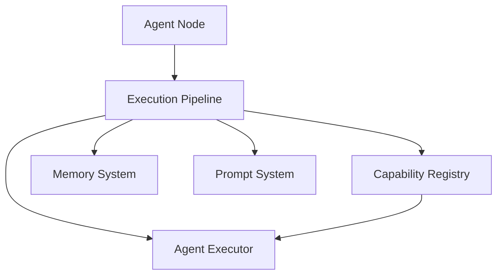
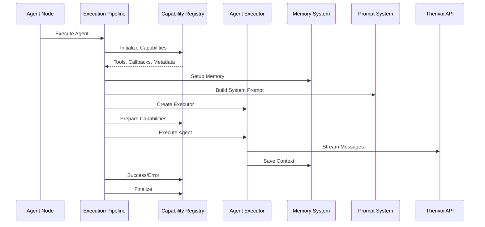

# Thenvoi Agent Node System Guide

## Overview

The Thenvoi Agent node enables AI agents to participate in Thenvoi chat rooms, respond to @mentions, use tools, collaborate with other agents, and maintain conversation context. The node orchestrates agent execution through a structured [execution pipeline](../../../glossary.md#execution-pipeline) that coordinates capabilities, tools, memory, and real-time messaging.

The agent node system manages the complete lifecycle of agent execution, from initialization through cleanup, ensuring proper resource management, error handling, and integration with the Thenvoi platform.

## Architecture

### System Components

The agent node system consists of:

- **[Execution Pipeline](../../../glossary.md#execution-pipeline)**: Orchestrates the six-phase execution lifecycle
- **Capability System**: Extensible architecture for adding functionality
- **Memory System**: Enhanced memory with [structured data](../../../glossary.md#structured-data) storage
- **Prompt System**: Dynamic prompt assembly with [dynamic context](../../../glossary.md#dynamic-context) injection
- **Tool System**: Tool registration and execution management
- **Message Processing**: Real-time message streaming and [message queue](../../../glossary.md#message-queue) management

See component guides below for detailed information about each system.

## Data Flow

### Complete Execution Flow

## Component Guides

### Execution Pipeline

The execution pipeline orchestrates agent execution through six phases. See [Execution Pipeline Guide](../execution/execution_pipeline_guide.md) for:

- Phase-by-phase breakdown
- Resource management
- Error handling flow
- Integration with capabilities

### Capability System

The capability system provides extensible functionality through lifecycle hooks. See [Capability System Guide](../capabilities/capability_system_guide.md) for:

- Capability interface and lifecycle
- Priority-based execution
- Built-in capabilities (Messaging, Collaboration)
- Creating custom capabilities

### Memory System

The memory system enhances LangChain memory with structured data storage. See [Memory System Guide](../memory/memory_system_guide.md) for:

- Memory wrapper pattern
- Structured data storage
- Sender attribution
- Message history loading

### Prompt System

The prompt system builds dynamic system prompts with context injection. See [Prompt System Guide](../prompting/prompt_system_guide.md) for:

- Template-based assembly
- User content injection
- Dynamic context injection
- Message history formatting

### Tool System

The tool system manages tool registration and execution. See [Tool System Guide](../tools/tool_system_guide.md) for:

- Built-in tools
- Tool registration process
- Tool execution flow
- Custom tool creation

### Message Processing

The message processing system handles real-time message streaming. See [Message Processing Guide](../messaging/message_processing_guide.md) for:

- Message queue system
- Message type routing
- Mention detection
- Processing status updates

## Integration Points

### Capability Integration

Capabilities integrate into the execution pipeline through lifecycle hooks:

1. **Initialize Phase**: Capabilities provide tools, callbacks, and metadata
2. **Prepare Phase**: Capabilities can inspect/modify the executor
3. **Execute Phase**: Callbacks stream agent activity
4. **Success/Error Phase**: Capabilities handle outcomes
5. **Finalize Phase**: Capabilities cleanup resources

See [Capability System Guide](../capabilities/capability_system_guide.md) for details.

### Memory Integration

Memory integrates throughout the execution lifecycle:

1. **Setup Phase**: Memory configured based on message history source
2. **Prepare Phase**: Memory attached to callbacks for intermediate step capture
3. **Execute Phase**: Callbacks capture intermediate steps
4. **After Execute**: Memory saves structured data

See [Memory System Guide](../memory/memory_system_guide.md) for details.

### Prompt Integration

Prompts are built during setup with dynamic context:

1. **Setup Phase**: Fetch dynamic context (room, participants, messages, tools)
2. **Setup Phase**: Build system prompt with user content and dynamic context
3. **Execute Phase**: Agent uses prompt with complete context

See [Prompt System Guide](../prompting/prompt_system_guide.md) for details.

### Tool Integration

Tools are collected and registered during setup:

1. **Initialize Phase**: Capabilities provide tools
2. **Setup Phase**: Connected tools retrieved and combined
3. **Setup Phase**: All tools registered with executor
4. **Execute Phase**: Agent can call tools

See [Tool System Guide](../tools/tool_system_guide.md) for details.

### Message Processing Integration

Message processing streams agent activity in real-time:

1. **Initialize Phase**: Messaging capability creates message queue
2. **Execute Phase**: Callbacks enqueue messages
3. **Success Phase**: Final messages sent
4. **Finalize Phase**: Queue waits for all messages

See [Message Processing Guide](../messaging/message_processing_guide.md) for details.

## Built-in Capabilities

### Messaging Capability

Streams agent activity to Thenvoi chat in real-time:
- Task updates (in progress, completed, failed)
- Thoughts (agent reasoning)
- Tool calls and results
- Final responses
- Mention detection and processing

Provides the `send_message` tool for agents to send visible messages.

### Agent Collaboration Capability

Enables agents to discover and add other participants:
- Lists available agents and users
- Adds participants to chat
- Removes participants from chat
- Updates participant lists for mention detection

Provides tools: `list_available_participants`, `add_participant_to_chat`, `remove_participant_from_chat`.

## Troubleshooting

### Agent Not Executing

- Verify execution pipeline phases complete successfully
- Check capability initialization doesn't fail
- Ensure agent executor is created correctly
- Verify model and tools are configured

See [Execution Pipeline Guide](../execution/execution_pipeline_guide.md) for details.

### Capabilities Not Working

- Verify capabilities are registered in registry
- Check capability priority values
- Ensure lifecycle methods are implemented
- Verify capability setup returns required resources

See [Capability System Guide](../capabilities/capability_system_guide.md) for details.

### Memory Not Saving

- Verify memory is configured in setup phase
- Check callbacks have memory attached
- Ensure intermediate steps are captured
- Verify structured data creation

See [Memory System Guide](../memory/memory_system_guide.md) for details.

### Prompts Not Building

- Verify base template file exists
- Check user content is properly formatted
- Ensure dynamic context is fetched successfully
- Verify context formatters work correctly

See [Prompt System Guide](../prompting/prompt_system_guide.md) for details.

### Tools Not Available

- Verify tools are returned from capability setup
- Check tools are properly instantiated
- Ensure tools extend LangChain StructuredTool
- Verify tools are registered with executor

See [Tool System Guide](../tools/tool_system_guide.md) for details.

### Messages Not Sending

- Verify message queue is created
- Check HTTP client is configured correctly
- Ensure message type routing is correct
- Verify mention detection works

See [Message Processing Guide](../messaging/message_processing_guide.md) for details.

## Related Documentation

- [Execution Pipeline Guide](../execution/execution_pipeline_guide.md) - Execution lifecycle orchestration
- [Capability System Guide](../capabilities/capability_system_guide.md) - Extensible functionality system
- [Memory System Guide](../memory/memory_system_guide.md) - Enhanced memory with structured data
- [Prompt System Guide](../prompting/prompt_system_guide.md) - Dynamic prompt assembly
- [Tool System Guide](../tools/tool_system_guide.md) - Tool registration and execution
- [Message Processing Guide](../messaging/message_processing_guide.md) - Real-time message streaming
- [Agent Node User Guide](../../nodes/agent/agent_node_guide.md) - User guide for configuring agents
- [Glossary](../../../glossary.md) - Definitions of domain-specific terms

