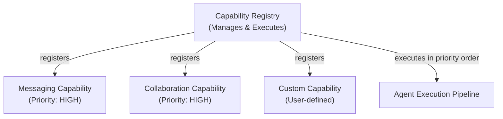
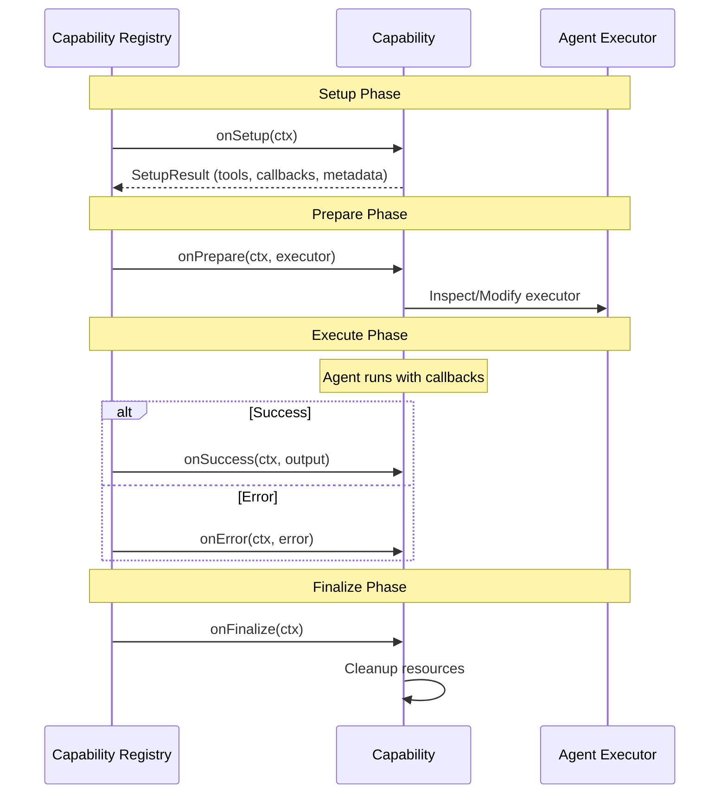
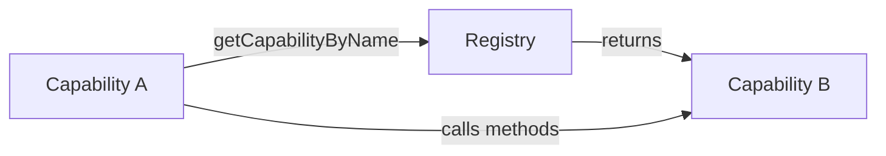
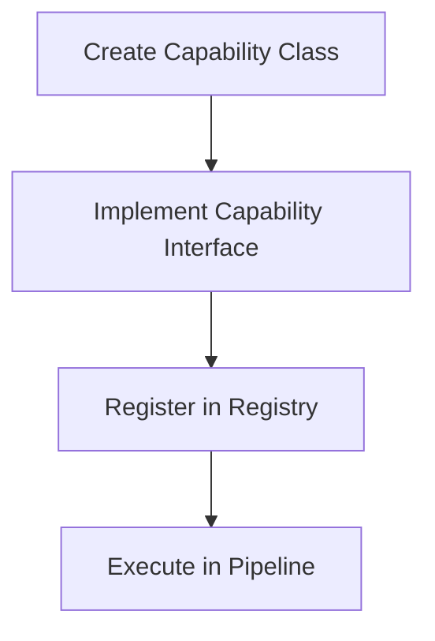

# Capability System Guide

## Overview

The [capability](../../../glossary.md#capability) system is an extensible architecture that allows the Thenvoi Agent node to add functionality through modular components. Capabilities hook into different phases of agent execution through lifecycle methods, enabling features like real-time messaging, agent collaboration, and custom extensions without modifying core agent logic.

Capabilities execute sequentially based on priority, ensuring predictable behavior and allowing dependencies between capabilities.

## Architecture

### The Capability Pattern

Capabilities extend agent functionality through lifecycle hooks:

**Key Point**: Capabilities don't modify core agent code—they extend it through well-defined interfaces.

### Components

1. **Capability Interface** - Defines lifecycle methods and priority
2. **[Capability Registry](../../../glossary.md#capability-registry)** - Manages registration and sequential execution
3. **Capability Context** - Provides execution state and shared resources
4. **Built-in Capabilities** - [Messaging Capability](../../../glossary.md#messaging-capability) and [Agent Collaboration Capability](../../../glossary.md#agent-collaboration-capability)

## Data Flow

### [Capability Lifecycle](../../../glossary.md#capability-lifecycle)

Capabilities participate in five lifecycle phases:

### Priority-Based Execution

Capabilities execute in priority order (lower values execute first):

- **CRITICAL (0)** - Must run first (e.g., authentication, critical setup)
- **HIGH (25)** - Important but not critical (e.g., messaging, collaboration)
- **NORMAL (50)** - Default priority
- **LOW (75)** - Can run later
- **CLEANUP (100)** - Should run last

Sequential execution ensures:
- Proper message ordering
- Capability dependencies are respected
- Easier debugging and testing

## Key Concepts

### Capability Interface

Each capability implements:
- **name** - Unique identifier
- **priority** - Execution order (lower executes first)
- **onSetup()** - Initialize resources, create tools/callbacks
- **onPrepare()** - Inspect or modify the agent executor
- **onSuccess()** - Handle successful execution results
- **onError()** - Handle execution failures
- **onFinalize()** - Cleanup resources (runs after success or error)

### Setup Result

Capabilities return a `SetupResult` containing:
- **tools** - LangChain tools to add to the agent
- **callbacks** - Callback handlers for streaming events
- **metadata** - Data for prompt augmentation or cross-capability communication

### Capability Context

Shared execution context provides:
- **execution** - n8n execution functions
- **config** - Agent node configuration
- **credentials** - Thenvoi API credentials
- **input** - User input for the agent
- **messageId** - ID of the message being processed
- **httpClient** - HTTP client for API requests
- **registry** - Reference to capability registry for cross-capability access

### Cross-Capability Communication

Capabilities can access other capabilities through the registry:

This enables capabilities to coordinate (e.g., MessagingCapability updating participant lists when CollaborationCapability adds agents).

## Integration Points

### Registration

Capabilities are registered during agent initialization:

1. Registry is created
2. Capabilities are instantiated and registered
3. Registry sorts by priority
4. Capabilities execute in sorted order

### Execution Pipeline Integration

Capabilities integrate into the execution pipeline:

1. **Initialize Capabilities** - Setup phase collects tools and metadata
2. **Setup Phase** - Agent components created with capability tools
3. **Prepare Phase** - Capabilities can inspect/modify executor
4. **Execute Phase** - Callbacks stream agent activity
5. **Success/Error Phase** - Capabilities handle outcomes
6. **Finalize Phase** - Capabilities cleanup resources

See [Execution Pipeline Guide](../execution/execution_pipeline_guide.md) for details.

## Built-in Capabilities

### [Messaging Capability](../../../glossary.md#messaging-capability)

**Priority**: HIGH (25)

Handles real-time streaming of agent activity to Thenvoi chat:
- Task updates (in progress, completed, failed)
- Thoughts (agent reasoning)
- Tool calls and results
- Final responses
- Mention detection and processing

**Provides**:
- `send_message` tool for agents to send visible messages
- Callback handler for streaming events
- Message queue management

### [Agent Collaboration Capability](../../../glossary.md#agent-collaboration-capability)

**Priority**: HIGH (25)

Enables agents to discover and add other participants:
- Lists available agents and users
- Adds participants to chat
- Removes participants from chat
- Updates participant lists for mention detection

**Provides**:
- `list_available_participants` tool
- `add_participant_to_chat` tool
- `remove_participant_from_chat` tool
- Metadata for prompt augmentation (available agents, room info)

## Creating Custom Capabilities

### Basic Structure

### Steps

1. **Create capability class** implementing `Capability` interface
2. **Define priority** based on dependencies
3. **Implement lifecycle methods** as needed
4. **Return tools/callbacks** from `onSetup()` if needed
5. **Register capability** in the capability registry factory

### Example: Custom Capability

A custom capability might:
- Add specialized tools for domain-specific tasks
- Stream custom events to external systems
- Modify agent behavior based on configuration
- Integrate with external APIs

### Best Practices

**Priority Selection**:
- Use CRITICAL only for essential setup (auth, critical resources)
- Use HIGH for important features (messaging, collaboration)
- Use NORMAL for standard features
- Use CLEANUP for cleanup operations

**Resource Management**:
- Initialize resources in `onSetup()`
- Cleanup in `onFinalize()` (runs after success or error)
- Handle errors gracefully in `onError()`

**Cross-Capability Access**:
- Use registry to access other capabilities
- Coordinate through well-defined interfaces
- Avoid tight coupling between capabilities

## Related Documentation

- [Execution Pipeline Guide](../execution/execution_pipeline_guide.md) - How capabilities integrate into execution
- [Tool System Guide](../tools/tool_system_guide.md) - How capabilities provide tools
- [Message Processing Guide](../messaging/message_processing_guide.md) - How messaging capability works
- [Glossary](../../../glossary.md) - Definitions of domain-specific terms

## Troubleshooting

### Capability Not Executing

- Verify capability is registered in the registry factory
- Check priority is set correctly
- Ensure lifecycle methods are implemented

### Tools Not Available

- Verify `onSetup()` returns tools in `SetupResult`
- Check tools are properly instantiated
- Ensure tools extend LangChain `StructuredTool`

### Callbacks Not Firing

- Verify `onSetup()` returns callbacks in `SetupResult`
- Check callbacks extend LangChain `BaseCallbackHandler`
- Ensure callback configuration is correct

### Cross-Capability Access Failing

- Verify capability name matches exactly
- Check capability is registered before access
- Ensure capability exposes needed methods

