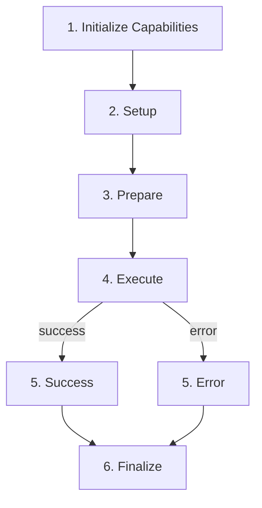
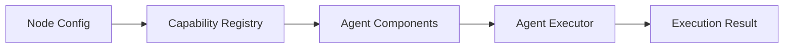
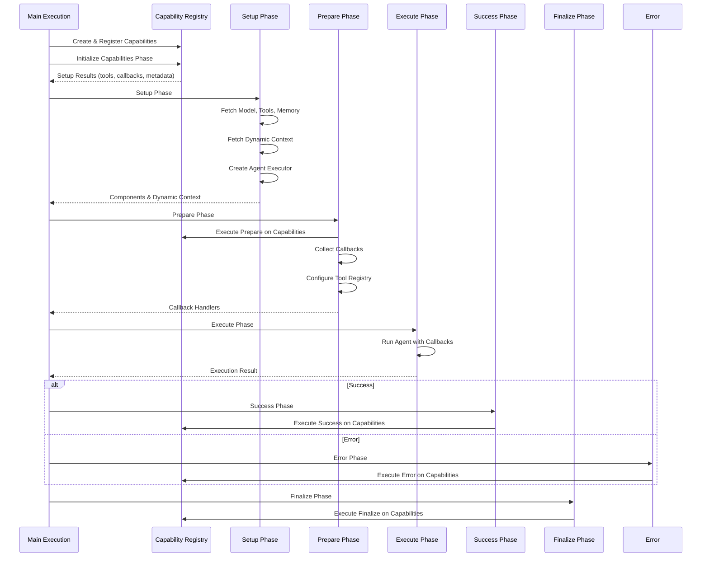
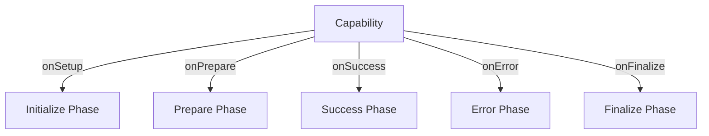
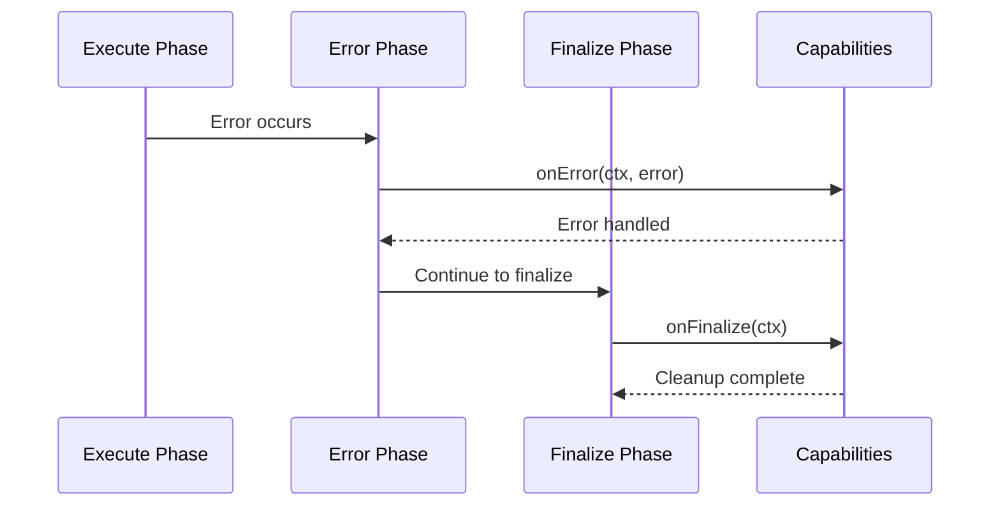
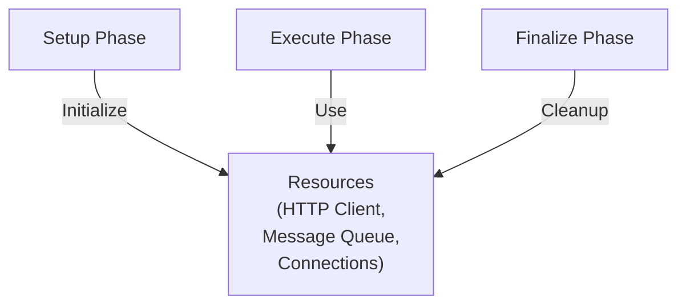

# Execution Pipeline Guide

## Overview

The [execution pipeline](../../../glossary.md#execution-pipeline) orchestrates the complete lifecycle of agent execution, from initialization through cleanup. It coordinates capabilities, agent components, and resources to ensure proper setup, execution, error handling, and cleanup.

The pipeline follows a structured phase-based approach that separates concerns and ensures resources are properly managed throughout the execution lifecycle.

## Architecture

### Pipeline Phases

The execution pipeline consists of six sequential phases:

**Key Point**: Finalize always runs regardless of success or failure, ensuring proper cleanup.

### Component Flow

## Data Flow

### Complete Pipeline Sequence

## Key Concepts

### Phase 1: Initialize Capabilities

**Purpose**: Collect tools and metadata from [capabilities](../../../glossary.md#capability) before creating the agent executor.

**Process**:
1. Execute `onSetup()` for all capabilities in priority order
2. Collect tools from all capabilities
3. Collect callbacks from all capabilities
4. Collect metadata for prompt augmentation

**Output**: Setup results containing tools, callbacks, and metadata.

**Why Separate**: Capabilities need to provide tools before the executor is created, but some setup (like fetching data) can happen in parallel.

### Phase 2: Setup

**Purpose**: Retrieve all agent components and create the executor with [dynamic context](../../../glossary.md#dynamic-context).

**Process**:
1. Fetch connected model from node connections
2. Fetch connected tools from node connections
3. Combine connected tools with capability-provided tools
4. Setup memory based on configuration
5. Fetch dynamic context (room info, participants, recent messages)
6. Create agent executor with all components
7. Build system prompt with dynamic context injection

**Output**: Agent components (model, tools, memory, executor) and dynamic context.

**Why Separate**: Component retrieval and executor creation require all tools to be available, which comes from the initialize phase.

### Phase 3: Prepare

**Purpose**: Finalize capabilities and configure callbacks for execution.

**Process**:
1. Execute `onPrepare()` for all capabilities (can inspect/modify executor)
2. Collect all callback handlers from setup results
3. Build tool name registry for callback handlers
4. Configure memory on callbacks that support it

**Output**: Configured callback handlers ready for execution.

**Why Separate**: Capabilities need access to the executor before execution starts, and callbacks need tool registry configuration.

### Phase 4: Execute

**Purpose**: Run the agent with configured callbacks.

**Process**:
1. Execute agent with user input
2. Callbacks stream agent activity in real-time
3. Intermediate steps captured for memory
4. Return execution result with output and intermediate steps

**Output**: Execution result containing output and intermediate steps.

**Why Separate**: Execution is the core operation that uses all previously configured components.

### Phase 5: Success/Error

**Purpose**: Handle execution outcomes through capabilities.

**Success Process**:
1. Execute `onSuccess()` for all capabilities in priority order
2. Capabilities handle successful results (e.g., send final response, update status)

**Error Process**:
1. Execute `onError()` for all capabilities in priority order
2. Capabilities handle errors (e.g., send error notifications, cleanup)

**Why Separate**: Capabilities need to react to outcomes, and sequential execution ensures proper ordering.

### Phase 6: Finalize

**Purpose**: Cleanup resources regardless of success or failure.

**Process**:
1. Execute `onFinalize()` for all capabilities in priority order
2. Capabilities cleanup resources (e.g., wait for pending messages, release connections)

**Why Separate**: Cleanup must always happen, even if execution fails. This phase ensures resources are released.

## Integration Points

### Capability Integration

Capabilities hook into multiple phases:

**Note**: Capabilities hook into setup via `onSetup()` during the **Initialize Capabilities Phase** (shown as "Initialize Phase" above). The separate **Setup Phase** (Phase 2) doesn't have capability hooks—it uses the tools and callbacks collected from the Initialize phase to create the executor. The **Execute Phase** also doesn't have direct capability hooks—it uses callbacks configured during Initialize.

See [Capability System Guide](../capabilities/capability_system_guide.md) for details.

### Memory Integration

Memory is configured during setup and used during execution:

1. **Setup**: Memory configured based on message history source
2. **Prepare**: Memory attached to callbacks for intermediate step capture
3. **Execute**: Callbacks capture intermediate steps
4. **After Execute**: Memory saves structured data with intermediate steps

See [Memory System Guide](../memory/memory_system_guide.md) for details.

### Prompt Integration

Dynamic context is fetched during setup and injected into prompts:

1. **Setup**: Fetch room info, participants, recent messages
2. **Setup**: Build system prompt with dynamic context
3. **Execute**: Agent uses prompt with injected context

See [Prompt System Guide](../prompting/prompt_system_guide.md) for details.

## Error Handling

### Error Flow

### Error Handling Principles

1. **Errors propagate**: Execution errors propagate to error phase
2. **Capabilities handle**: Each capability can handle errors independently
3. **Finalize always runs**: Cleanup happens regardless of errors
4. **Partial failures**: One capability failure doesn't prevent others from finalizing

## Resource Management

### Resource Lifecycle

### Resource Cleanup

Resources are managed through capabilities:
- **HTTP Client**: Created in capability context, used throughout execution
- **Message Queue**: Created in messaging capability, finalized in `onFinalize()`
- **Connections**: Managed by capabilities, cleaned up in `onFinalize()`

## Related Documentation

- [Capability System Guide](../capabilities/capability_system_guide.md) - How capabilities integrate
- [Memory System Guide](../memory/memory_system_guide.md) - How memory integrates
- [Prompt System Guide](../prompting/prompt_system_guide.md) - How prompts are built
- [Tool System Guide](../tools/tool_system_guide.md) - How tools are integrated
- [Glossary](../../../glossary.md) - Definitions of domain-specific terms

## Troubleshooting

### Pipeline Not Completing

- Check error logs for phase failures
- Verify capabilities aren't throwing unhandled errors
- Ensure finalize phase completes even on errors

### Capabilities Not Executing

- Verify capabilities are registered in registry factory
- Check capability priority values
- Ensure lifecycle methods are implemented

### Resources Not Cleaned Up

- Verify `onFinalize()` is implemented in capabilities
- Check finalize phase always runs (even on errors)
- Ensure cleanup logic waits for pending operations

### Memory Not Saving

- Verify memory is configured in setup phase
- Check callbacks have memory attached in prepare phase
- Ensure intermediate steps are captured during execution

