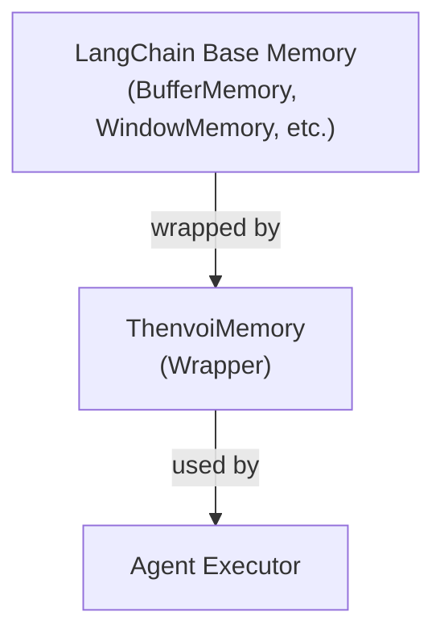
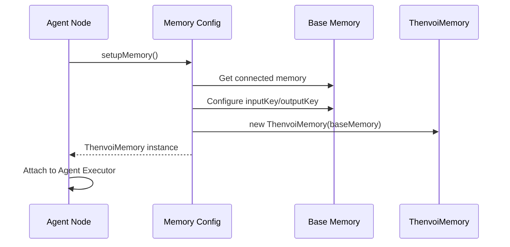
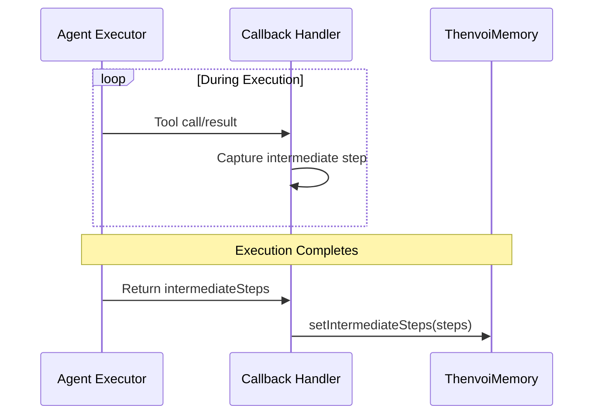
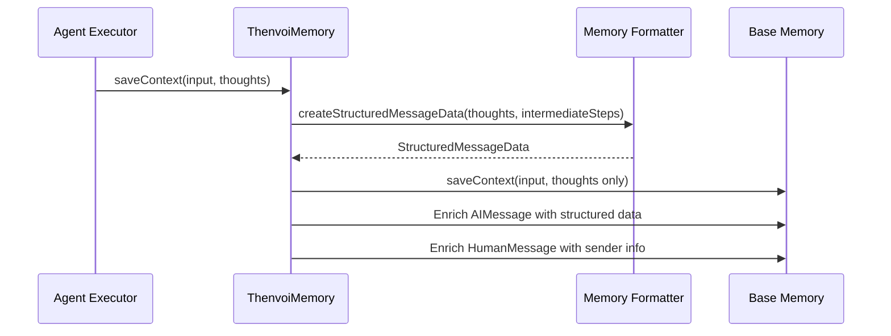
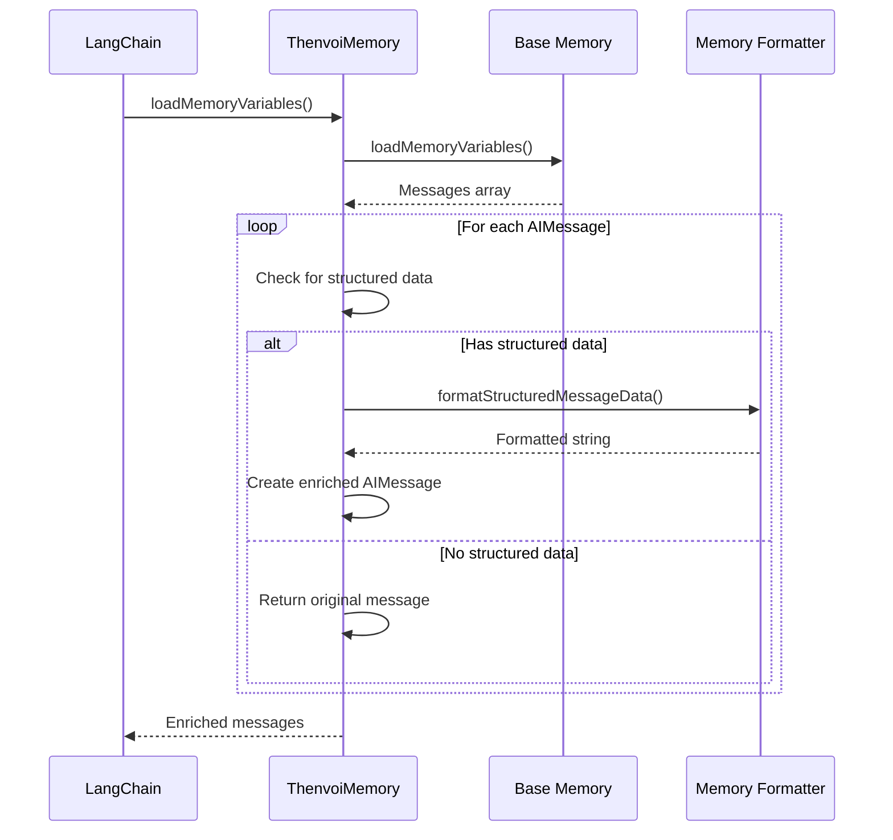
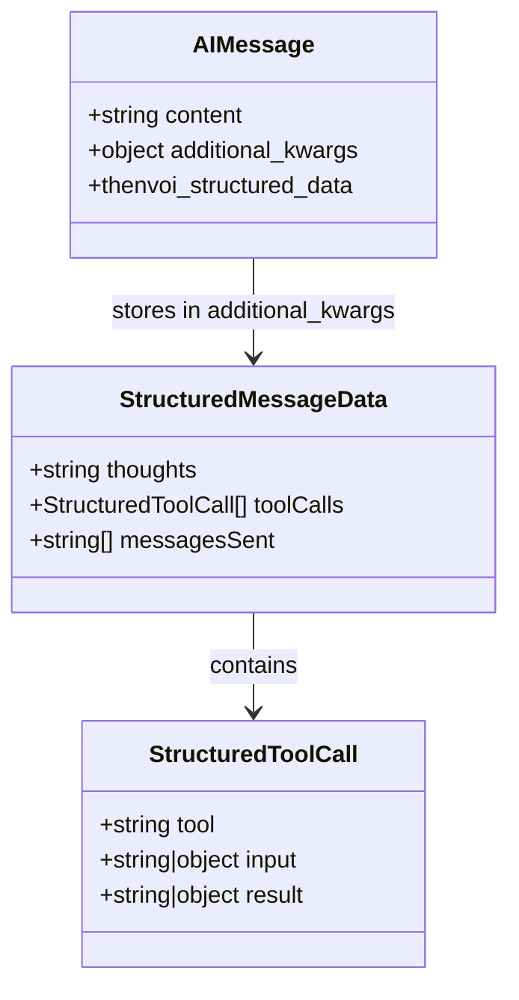
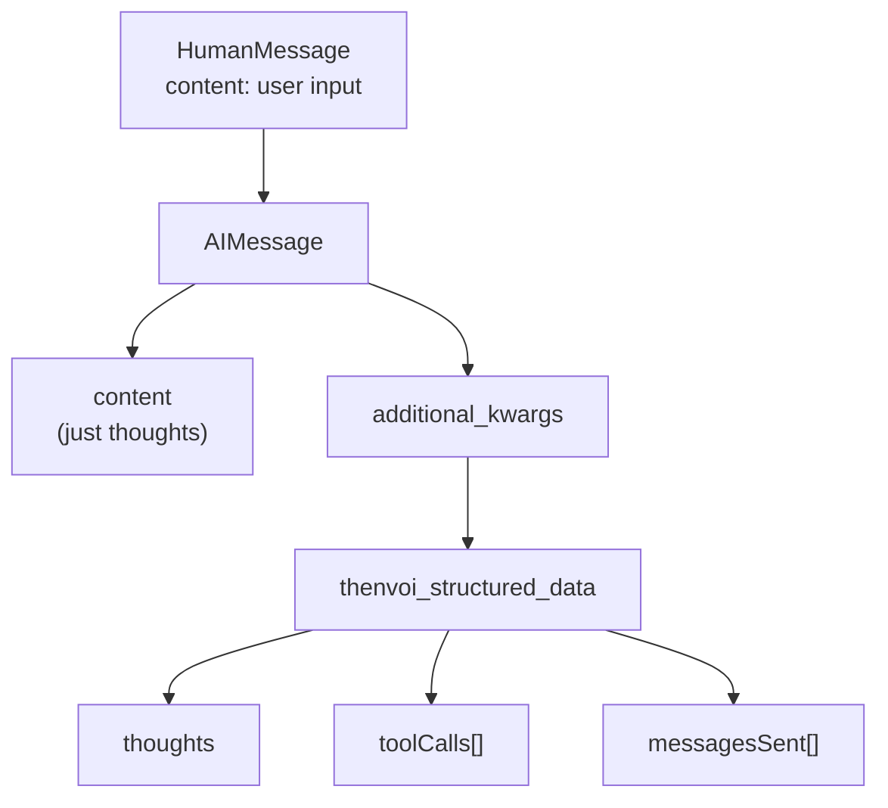
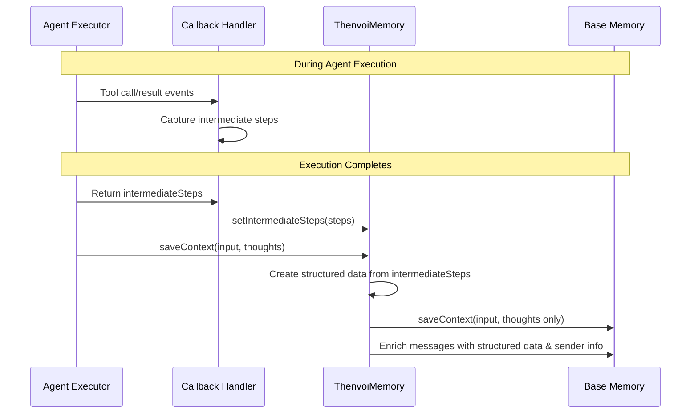
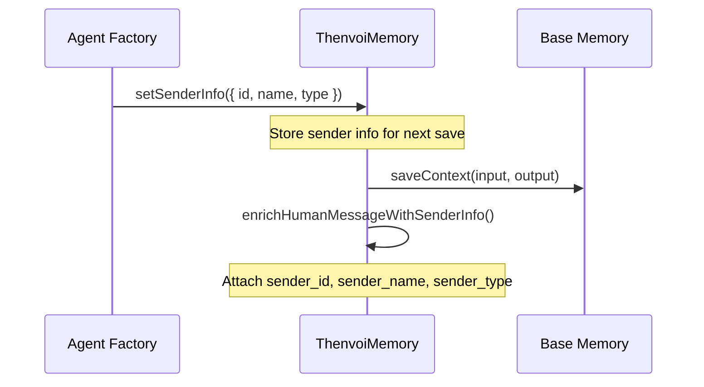
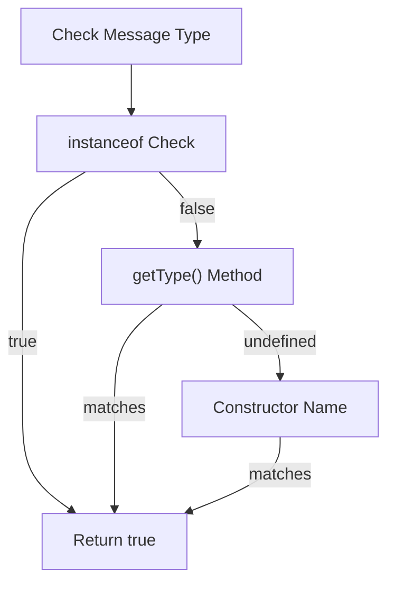

# Memory System Guide

## Overview

The Thenvoi memory system is a wrapper around LangChain's memory implementations that enhances storage to preserve complete agent execution context. Instead of just storing plain text messages, it stores [structured data](../../../glossary.md#structured-data) including:

- **[Thoughts](../../../glossary.md#thoughts)** (the LLM's reasoning/output)
- **[Tool calls](../../../glossary.md#tool-calls)** (which tools were called, with inputs and results)
- **Messages sent** (messages sent via the `send_message` tool)

This structured approach allows the system to reconstruct full context when loading from memory, providing better continuity across conversations.

## Architecture

### The Wrapper Pattern

The memory system uses a **wrapper pattern**:



**Key Point**: `ThenvoiMemory` wraps any LangChain memory implementation. It doesn't replace it—it enhances it.

### Components

1. **ThenvoiMemory** (main wrapper class)
   - Extends LangChain's `BaseChatMemory`
   - Wraps a [base memory](../../../glossary.md#base-memory) implementation (e.g., BufferMemory, WindowMemory)
   - Handles [structured data](../../../glossary.md#structured-data) storage and retrieval

2. **Memory Formatter** (utility module)
   - Creates [structured data](../../../glossary.md#structured-data) from execution results
   - Formats structured data back into readable strings for prompts

3. **Memory Config Factory** (configuration module)
   - Sets up and configures memory based on node settings
   - Wraps [base memory](../../../glossary.md#base-memory) with `ThenvoiMemory`

## Data Flow

### Overview

The memory system flows through four main phases: **Setup** → **Execution** → **Save** → **Load**

### 1. Setup Phase



The setup process involves:

1. **Fetching** the connected memory node (e.g., BufferMemory, WindowMemory)
2. **Configuring** the [base memory](../../../glossary.md#base-memory) with required keys for LangChain compatibility
3. **Wrapping** the base memory with `ThenvoiMemory` to add [structured data](../../../glossary.md#structured-data) capabilities
4. **Attaching** the wrapped memory to the agent executor

The wrapper preserves all functionality of the [base memory](../../../glossary.md#base-memory) while adding enhanced storage capabilities.

### 2. Execution Phase

During agent execution, the callback handler captures all [intermediate steps](../../../glossary.md#intermediate-steps) (tool calls and results). Before saving, the system sets these intermediate steps on memory:



**Why capture intermediate steps?** The system needs the complete execution result (including all [tool calls](../../../glossary.md#tool-calls)) before it can save [structured data](../../../glossary.md#structured-data). This ensures all [intermediate steps](../../../glossary.md#intermediate-steps) are available when creating the [enhanced context](../../../glossary.md#enhanced-context).

### 3. Enhanced Save Phase

After execution completes, LangChain calls `saveContext()` with the user input and agent thoughts. The system then saves everything with [structured data](../../../glossary.md#structured-data). The process:

1. **Extracts** [thoughts](../../../glossary.md#thoughts) from the LLM output
2. **Uses** [intermediate steps](../../../glossary.md#intermediate-steps) that were set before saveContext was called
3. **Separates** [tool calls](../../../glossary.md#tool-calls) (excluding `send_message` calls)
4. **Extracts** messages sent via the `send_message` tool
5. **Creates** [structured data](../../../glossary.md#structured-data) object containing all three components
6. **Saves** to [base memory](../../../glossary.md#base-memory) with only [thoughts](../../../glossary.md#thoughts) as the message content
7. **Enriches** the saved AIMessage by storing the complete [structured data](../../../glossary.md#structured-data) as [enriched metadata](../../../glossary.md#enriched-metadata)
8. **Enriches** the saved HumanMessage with sender information for proper attribution



### 4. Loading Phase

When loading memory for the next execution:



The loading process:

1. **Delegates** to [base memory](../../../glossary.md#base-memory) to load the raw message history
2. **Iterates** through each message in the history
3. **Checks** if the message is an AIMessage with [structured data](../../../glossary.md#structured-data)
4. **Reconstructs** formatted content from [structured data](../../../glossary.md#structured-data) (combining [thoughts](../../../glossary.md#thoughts), [tool calls](../../../glossary.md#tool-calls), and messages)
5. **Returns** enriched messages with full context formatted for prompts

If [structured data](../../../glossary.md#structured-data) isn't available (e.g., old memory), the system falls back to the original message content.

## Storage Format

### Structured Data Structure



**StructuredMessageData** contains:
- `thoughts`: The agent's [thoughts](../../../glossary.md#thoughts) (string)
- `toolCalls`: Array of [tool calls](../../../glossary.md#tool-calls), each with:
  - `tool`: Tool name
  - `input`: Tool input (string or object)
  - `result`: Tool result (string or object)
- `messagesSent`: Array of message contents sent via `send_message` tool

Note: `toolCalls` excludes `send_message` calls, which are stored separately in `messagesSent`.

### How It's Stored



1. **In LangChain Memory**:
   - `HumanMessage`: User input (standard format)
   - `AIMessage`: 
     - `content`: Just the agent's [thoughts](../../../glossary.md#thoughts) (clean, unformatted)
     - `additional_kwargs.thenvoi_structured_data`: Complete [structured data](../../../glossary.md#structured-data)

2. **Why This Format?**
   - **Structured data** preserves [tool calls](../../../glossary.md#tool-calls) and messages as objects, not strings
   - **Thoughts-only content** keeps the [base memory](../../../glossary.md#base-memory) message clean
   - **Backward compatible** with existing LangChain memory implementations
   - **Extensible** for future [enriched metadata](../../../glossary.md#enriched-metadata)

### Example Storage

**What gets stored in [base memory](../../../glossary.md#base-memory):**

The system stores a HumanMessage with the user input, and an AIMessage containing:
- The [thoughts](../../../glossary.md#thoughts) as the main content
- [Structured data](../../../glossary.md#structured-data) in `additional_kwargs.thenvoi_structured_data` containing:
  - The same [thoughts](../../../glossary.md#thoughts) text
  - An array of [tool calls](../../../glossary.md#tool-calls) with tool name, input, and result
  - An array of messages sent (empty if none)

**What gets loaded into prompts:**

When loading from memory, the [structured data](../../../glossary.md#structured-data) is formatted into a readable string with sections:
- `[Thoughts]`: The agent's [thoughts](../../../glossary.md#thoughts)
- `[Tool Calls]`: List of [tool calls](../../../glossary.md#tool-calls) with inputs and results
- `[Messages Sent]`: Messages sent via the `send_message` tool (or empty if none)

## Key Operations

### Creating Structured Data

The system creates [structured data](../../../glossary.md#structured-data) by:
- Extracting [thoughts](../../../glossary.md#thoughts) from the LLM output
- Separating [tool calls](../../../glossary.md#tool-calls) (excluding `send_message` calls)
- Extracting `send_message` calls into a separate array
- Combining everything into a structured object

### Formatting for Prompts

When loading from memory, [structured data](../../../glossary.md#structured-data) is formatted back into a readable string with sections:
- `[Thoughts]`: Agent's [thoughts](../../../glossary.md#thoughts)
- `[Tool Calls]`: List of [tool calls](../../../glossary.md#tool-calls) with inputs and results
- `[Messages Sent]`: Messages sent via the `send_message` tool

This formatted string is injected into prompts to provide full context to the agent.

## Important Details

### How Intermediate Steps Are Captured



1. **During Execution**: The callback handler captures all [intermediate steps](../../../glossary.md#intermediate-steps) as tools are called
2. **Before Save**: `setIntermediateSteps()` is called with all captured tool calls and results
3. **During Save**: `saveContext()` is called by LangChain with user input and agent thoughts
   - Uses the previously set [intermediate steps](../../../glossary.md#intermediate-steps) to create [structured data](../../../glossary.md#structured-data)
   - Saves to [base memory](../../../glossary.md#base-memory) with thoughts as content
   - Enriches messages with [structured data](../../../glossary.md#structured-data) and sender information

### Intermediate Steps

The agent executor **always** collects [intermediate steps](../../../glossary.md#intermediate-steps) (even if the user doesn't want them in the output).

**Why?** Memory needs [tool calls](../../../glossary.md#tool-calls) to create [structured data](../../../glossary.md#structured-data). The output formatter filters them out if the user doesn't want them displayed, but memory always has access to the complete [execution context](../../../glossary.md#execution-context).

### Fallback Behavior

If [structured data](../../../glossary.md#structured-data) isn't available (e.g., loading old memory):

1. Try to get [structured data](../../../glossary.md#structured-data) from [enriched metadata](../../../glossary.md#enriched-metadata)
2. Fallback to matching by content in internal map
3. If still not found, return original message (backward compatible)

### Memory Key Configuration

LangChain memory requires explicit key configuration:
- `inputKey`: Field name for storing user input (typically `'input'`)
- `outputKey`: Field name for storing agent output (typically `'output'`)

This configuration is handled automatically during memory setup.

## Related Documentation

- [Glossary](../../../glossary.md) - Definitions of domain-specific terms used in this guide
- [Agent Node Guide](../../nodes/agent/agent_node_guide.md) - How the agent node uses memory

## Integration Points

### Setting Up Memory

Memory setup happens during agent initialization:
- [Base memory](../../../glossary.md#base-memory) is fetched from the connected memory node
- Configured and wrapped with `ThenvoiMemory`
- Attached to the agent executor

### Saving After Execution

After agent execution completes:
- The callback handler calls `setIntermediateSteps()` with all captured [intermediate steps](../../../glossary.md#intermediate-steps)
- LangChain calls `saveContext()` with user input and agent thoughts
- [Structured data](../../../glossary.md#structured-data) is created from the intermediate steps and saved to [base memory](../../../glossary.md#base-memory)
- The saved messages are enriched with complete [execution context](../../../glossary.md#execution-context) and sender information

### Loading for Prompts

LangChain automatically calls `loadMemoryVariables()` when building prompts. The wrapper intercepts this call and enriches messages with formatted content from [structured data](../../../glossary.md#structured-data).

## Benefits

1. **Structured Storage**: [Tool calls](../../../glossary.md#tool-calls) and messages preserved as objects, not strings
2. **Complete Context**: Full [execution context](../../../glossary.md#execution-context) available for prompts
3. **Backward Compatible**: Works with existing LangChain memory implementations
4. **Extensible**: Easy to add new [enriched metadata](../../../glossary.md#enriched-metadata) fields
5. **Clean Separation**: [Thoughts](../../../glossary.md#thoughts) stored separately from [tool calls](../../../glossary.md#tool-calls) and messages

## Additional Patterns

### Sender Info Attribution

When saving messages to memory, the system enriches HumanMessages with sender information to enable proper attribution when displaying conversation history.

**The Pattern:**

1. **Before saving**: `setSenderInfo()` is called on `ThenvoiMemory` with the sender's ID, name, and type
2. **During save**: The HumanMessage is enriched with sender metadata in `additional_kwargs`
3. **During load**: Formatters read sender info from `additional_kwargs` to display actual user/agent names



**Benefits:**
- Messages display actual sender names instead of generic "User"
- Supports both users and agents as message senders
- Graceful fallback to "User" or "Unknown" if sender info unavailable

### Message Type Checking

LangChain messages can exist in two states:
1. **Direct instances**: Created with `new AIMessage()` or `new HumanMessage()`
2. **Deserialized objects**: Loaded from storage, losing `instanceof` checks

The message type utilities handle both cases:



**Implementation:**

```typescript
function isAIMessage(msg: unknown): boolean {
    // 1. Try instanceof (works for direct instances)
    if (msg instanceof AIMessage) return true;
    
    // 2. Try getType() method (works for some deserialized)
    if (msg.getType?.() === 'ai') return true;
    
    // 3. Check constructor name (fallback)
    return msg.constructor?.name === 'AIMessage';
}
```

**Why multiple checks?**
- `instanceof` fails for deserialized objects from storage
- `getType()` isn't always available on plain objects
- Constructor name check handles edge cases

## Troubleshooting

### Memory Not Saving

- Check that `ThenvoiMemory` is being used (not raw [base memory](../../../glossary.md#base-memory))
- Verify `setIntermediateSteps()` is being called before `saveContext()`
- Check that [intermediate steps](../../../glossary.md#intermediate-steps) are being captured by the callback handler

### Memory Not Loading

- Verify [structured data](../../../glossary.md#structured-data) exists in [enriched metadata](../../../glossary.md#enriched-metadata)
- Check fallback behavior if loading old memory
- Ensure `loadMemoryVariables()` is being called by LangChain

### Formatting Issues

- Ensure [structured data](../../../glossary.md#structured-data) creation includes all [intermediate steps](../../../glossary.md#intermediate-steps)
- Verify that [tool calls](../../../glossary.md#tool-calls) are being extracted correctly
- Check that `send_message` calls are being separated from other [tool calls](../../../glossary.md#tool-calls)

### Sender Info Not Displaying

- Verify `setSenderInfo()` is called before `saveContext()`
- Check that the participant lookup returns a valid name
- Ensure `additional_kwargs` is being read correctly by formatters

