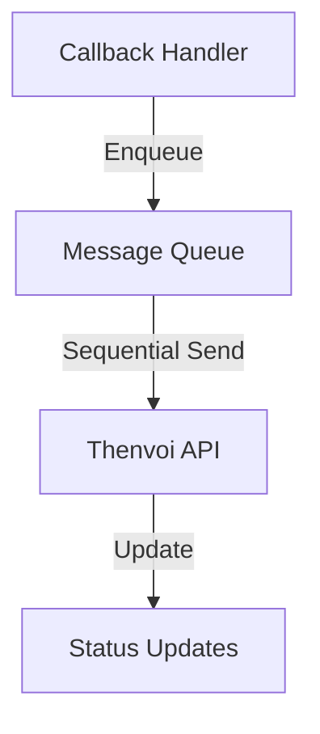
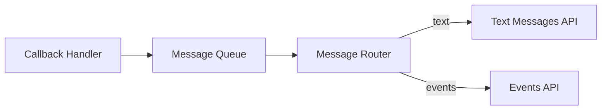
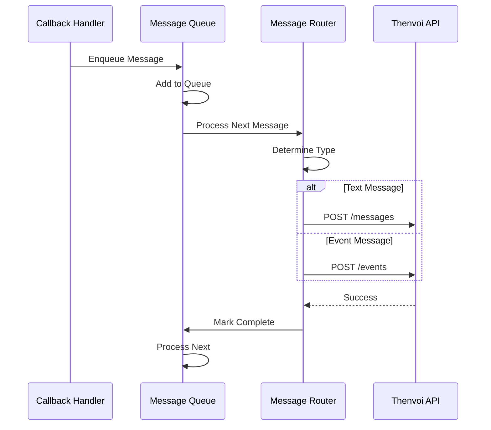
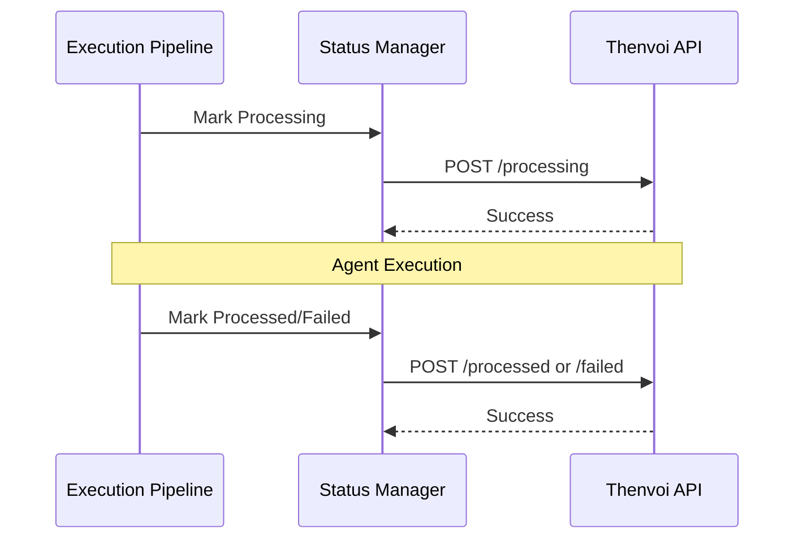
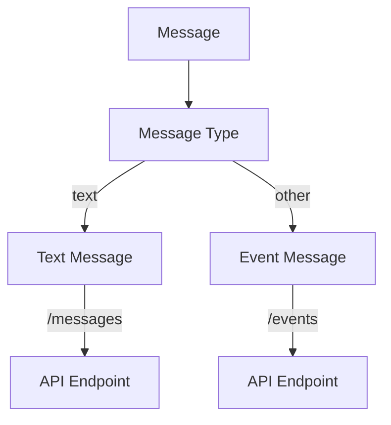
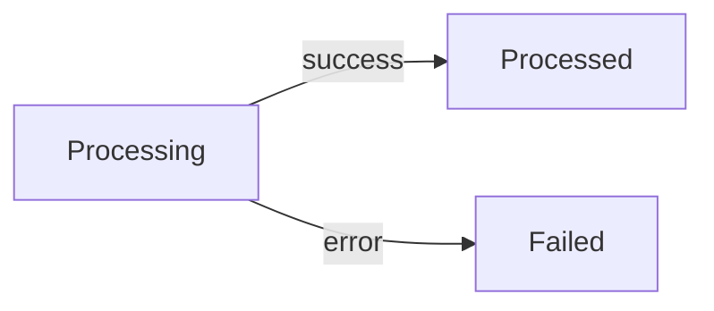
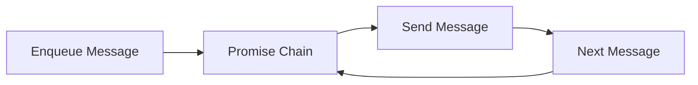

# Message Processing System Guide

## Overview

The message processing system handles sending messages and events to Thenvoi chat, managing [message queues](../../../glossary.md#message-queue), processing status updates, mention detection, and message type routing. It ensures messages are sent sequentially, properly formatted, and tracked through their lifecycle.

The system coordinates between callback handlers (which capture agent activity), message queues (which ensure sequential delivery), and the Thenvoi API (which receives the messages).

## Architecture

### Message Flow



### Component Flow



## Data Flow

### Message Sending Sequence



### Status Update Sequence



## Key Concepts

### [Message Queue](../../../glossary.md#message-queue)

The message queue ensures messages are sent sequentially:

**Purpose**: Prevents race conditions and maintains message order.

**Implementation**:
- Uses promise chaining to serialize sends
- Tracks queue count for monitoring
- Provides `wait()` to ensure all messages sent

**Queue Operations**:
- `enqueue()` - Add message to queue
- `wait()` - Wait for all queued messages
- `getCount()` - Get current queue size

### Message Types

#### Text Messages

**Type**: `'text'`

**Characteristics**:
- Visible messages to users/agents
- Require mentions array
- Sent via `/messages` endpoint
- Validated for mention presence

**Usage**: User-facing communication.

#### Event Messages

**Types**: `'task_update'`, `'thought'`, `'tool_call'`, `'tool_result'`

**Characteristics**:
- System events, not user messages
- No mention validation
- Sent via `/events` endpoint
- Used for agent activity streaming

**Usage**: Real-time agent activity updates.

### Message Routing

Messages are routed based on type:



**Routing Logic**:
- `'text'` → `/messages` endpoint (requires mentions)
- All other types → `/events` endpoint (no mentions)

### Mention Detection

Mention detection extracts @mentions from message text:

**Process**:
1. **Pattern Matching**: Find @handle patterns in text
2. **Participant Lookup**: Match handles to participant list
3. **Metadata Creation**: Create mention metadata for API
4. **Validation**: Ensure at least one mention exists

**Mention Format**:
- Pattern: `@handle` (case-sensitive)
- User handles: lowercase letters (a-z), numbers, hyphen, and dot in the middle only (e.g. `john.doe`)
- Agent handles: owner/slug format (e.g. `john.doe/weather-assistant`)
- A mention ends when followed by any character not valid for handles (e.g. `@john` in `@john-agent` does not match)
- User handles are not matched when they are a prefix of an agent handle (e.g. `@john.doe` does not match in `@john.doe/weather-assistant`)
- Must match participant handle exactly
- Multiple mentions supported

### Processing Status

Message processing status tracks message lifecycle:

**States**:
1. **Processing** - Message being processed by agent
2. **Processed** - Message successfully processed
3. **Failed** - Message processing failed

**Status Flow**:


**API Endpoints**:
- `POST /processing` - Mark as processing
- `POST /processed` - Mark as processed
- `POST /failed` - Mark as failed

## Integration Points

### Callback Handler Integration

Callback handlers use message queue:

1. **Handler Creation**: Queue created with HTTP client
2. **Event Capture**: Handler captures agent events
3. **Message Enqueue**: Events enqueued to queue
4. **Sequential Send**: Queue sends messages sequentially

### Execution Pipeline Integration

Status updates integrated into pipeline:

1. **Start**: Mark processing at execution start
2. **Success**: Mark processed on success
3. **Error**: Send error event to channel, mark failed, update message status

When execution fails, an error event is always sent to the channel so users see the failure in the chat.

See [Execution Pipeline Guide](../execution/execution_pipeline_guide.md) for details.

### Tool Integration

Send message tool uses queue:

1. **Tool Call**: Agent calls send_message tool
2. **Validation**: Tool validates message and mentions
3. **Enqueue**: Message enqueued to queue
4. **Return**: Tool returns success status

When a tool returns error JSON (e.g. send_message validation failure), an error event is also sent to the channel so users see the failure prominently.

See [Tool System Guide](../tools/tool_system_guide.md) for details.

## Message Queue Details

### Queue Implementation

The queue uses promise chaining:



**How It Works**:
- Each enqueue adds to promise chain
- Chain ensures sequential execution
- Next message waits for previous to complete

### Queue Waiting

The `wait()` method ensures all messages sent:

- Waits for promise chain to complete
- Handles errors gracefully
- Used before finalizing execution

## Message Formatting

### Text Message Format

```json
{
  "message": {
    "content": "@john.smith I've completed the analysis. Here are the results you requested.",
    "mentions": [
      {
        "id": "550e8400-e29b-41d4-a716-446655440000",
        "handle": "john.smith",
        "name": "John Smith"
      }
    ]
  }
}
```

Mentions require `id`; `handle` and `name` are optional.

### Event Message Format

```json
{
  "event": {
    "content": "Processing the request and determining the next steps.",
    "message_type": "thought"
  }
}
```

## Error Handling

### Queue Errors

**Error Handling**:
- Errors logged but don't stop queue
- Individual message failures logged
- Queue continues processing next message

**Error Logging**:
- Message ID tracked for debugging
- Error details logged with context
- Stack traces included when available

### API Errors

**Error Handling**:
- API errors propagate to queue
- Queue logs error and continues
- Status updates handle errors gracefully

**Status Update Errors**:
- Errors logged but don't fail execution
- Status updates are optional
- Execution continues even if status update fails

## Related Documentation

- [Execution Pipeline Guide](../execution/execution_pipeline_guide.md) - How messages are sent during execution
- [Tool System Guide](../tools/tool_system_guide.md) - How send_message tool works
- [API Client Guide](../api/api_client_guide.md) - API endpoints for messages
- [Glossary](../../../glossary.md) - Definitions of domain-specific terms

## Troubleshooting

### Messages Not Sending

- Verify message queue is created
- Check HTTP client is configured correctly
- Ensure API endpoints are accessible
- Verify message type routing is correct

### Messages Out of Order

- Check message queue is being used
- Verify sequential sending is working
- Ensure `wait()` is called before finalizing
- Check for concurrent queue instances

### Mentions Not Working

- Verify participant list is populated
- Check mention format matches participant handles
- Ensure mention detection is case-sensitive
- Verify mention metadata is created correctly

### Status Updates Failing

- Check processing attempt exists before marking processed/failed
- Verify API endpoints are correct
- Ensure error handling doesn't crash execution
- Check status update timing (must be after processing marked)


