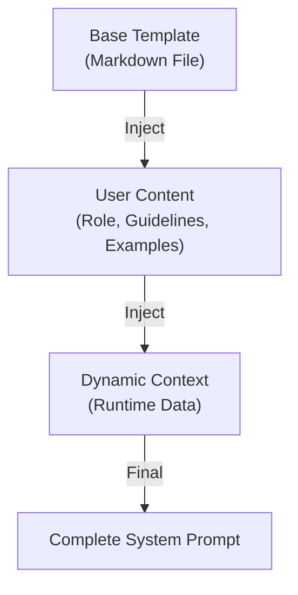
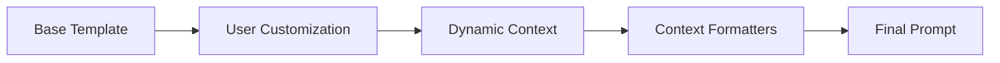
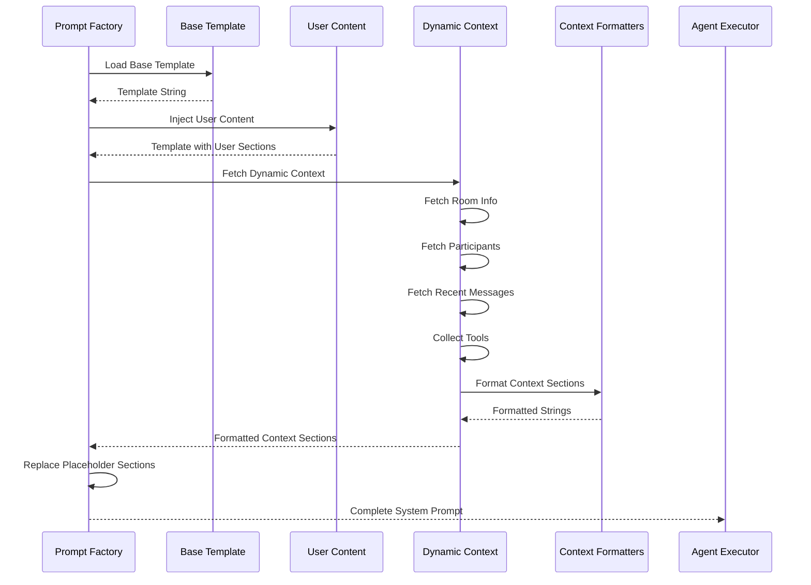
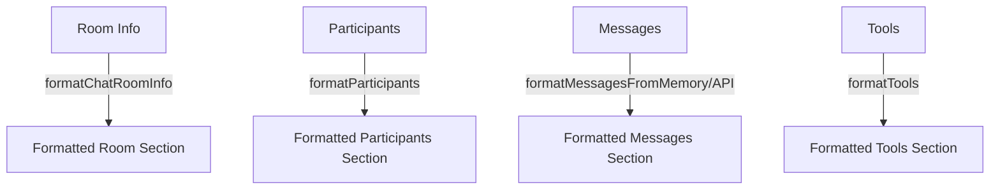
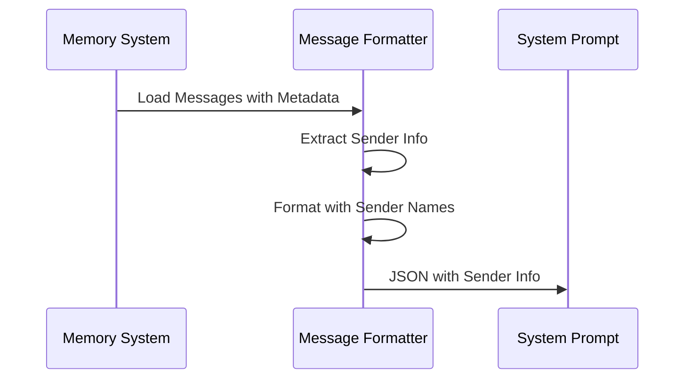
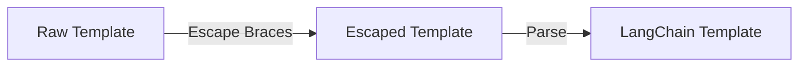
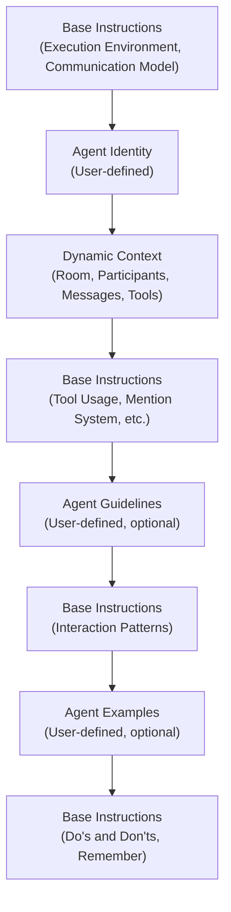

# Prompt System Guide

## Overview

The prompt system builds dynamic system prompts for AI agents by combining user-defined content ([agent role](../../../glossary.md#agent-role), [agent guidelines](../../../glossary.md#agent-guidelines), [agent examples](../../../glossary.md#agent-examples)) with runtime [dynamic context](../../../glossary.md#dynamic-context) (participants, messages, tools, room info). The system uses a template-based approach with placeholder sections that are replaced with formatted runtime data.

The prompt system ensures agents have complete context about their environment, capabilities, and conversation history while allowing users to customize agent behavior through structured prompt sections.

## Architecture

### Prompt Assembly Process



### Component Flow



## Data Flow

### Prompt Building Sequence



## Key Concepts

### Base Template

The base template is a markdown file containing:
- Static instructions and guidelines
- Placeholder sections for user content
- Placeholder sections for dynamic context

Placeholders use LangChain template syntax to mark sections:
- `{{USER_AGENT_ROLE}}` - User-defined agent role
- `{{USER_SPECIFIC_GUIDELINES}}` - User-defined guidelines
- `{{USER_EXAMPLES}}` - User-defined examples
- Dynamic context sections with `[System will inject...]` comments

### User Content Injection

User content is injected with headers:

1. **Agent Role** (required)
   - Injected with `## Agent Identity` header
   - Defines WHO the agent is and WHAT it does

2. **Agent Guidelines** (optional)
   - Injected with `## Agent-Specific Guidelines` header
   - Defines HOW the agent should behave
   - Skipped if empty

3. **Agent Examples** (optional)
   - Injected with `## Agent-Specific Examples` header
   - Shows example interactions
   - Skipped if empty

Empty sections are skipped entirely (not inserted as empty strings).

### [Dynamic Context](../../../glossary.md#dynamic-context) Injection

Dynamic context sections are replaced with formatted runtime data:

1. **Current Chat Room** - Room ID, title, created date
2. **Chat Participants** - List of participants with IDs, handles, names, types, roles
3. **Recent Messages** - Conversation history formatted as JSON
4. **Available Tools** - List of tools with names and descriptions

Each section uses a regex pattern to find and replace the entire section (including header and placeholder comment).

### [Context Formatters](../../../glossary.md#context-formatter)

Context formatters convert runtime data into formatted strings:



## Message History Formatting

### Memory Source

Messages from memory include [structured data](../../../glossary.md#structured-data):

```json
[
  {
    "sender_name": "John Smith",
    "sender_type": "User",
    "content": "What's the weather?"
  },
  {
    "sender_name": "Me",
    "sender_type": "Agent",
    "messagesSent": ["It's sunny!"],
    "toolCalls": [...],
    "thoughts": "..."
  }
]
```

**Features**:
- Sender information from stored metadata
- Structured data (thoughts, tool calls, messages sent) for AI messages
- "Me" for current agent's messages

### API Source

Messages from API include raw message data:

```json
[
  {
    "sender_id": "...",
    "sender_name": "John Smith",
    "sender_type": "User",
    "content": "What's the weather?",
    "timestamp": "2024-01-01T00:00:00.000Z"
  }
]
```

**Features**:
- Actual timestamps
- Raw message content
- No structured data (just text)

### Format Selection

The formatter selects based on message history source:
- **From Memory**: Uses `formatMessagesFromMemory()` with structured data
- **From API**: Uses `formatMessagesFromAPI()` with raw messages

Both formats use JSON for consistent LLM parsing.

## Sender Attribution

### How Sender Info Works



### Sender Info Sources

1. **From Memory Metadata**:
   - `sender_id`, `sender_name`, `sender_type` stored in `additional_kwargs`
   - Extracted when formatting messages

2. **AI Messages**:
   - Always attributed to current agent
   - Displayed as "Me" with type "Agent"

3. **Fallback**:
   - "User" for HumanMessages without metadata
   - "Unknown" for unrecognized message types

## Template Escaping

### Why Escaping is Needed

LangChain templates use `{variableName}` for template variables. User content and examples may contain literal curly braces (e.g., JSON, code examples).

### Escaping Process



All single braces `{` and `}` are escaped to `{{` and `}}` to prevent template parsing errors.

## Integration Points

### Execution Pipeline Integration

Prompt building happens during setup phase:

1. **Setup Phase**: Fetch dynamic context (room, participants, messages, tools)
2. **Setup Phase**: Build system prompt with all injections
3. **Setup Phase**: Create agent executor with prompt
4. **Execute Phase**: Agent uses prompt with complete context

See [Execution Pipeline Guide](../execution/execution_pipeline_guide.md) for details.

### Memory Integration

Message history comes from memory when configured:

1. **Setup Phase**: Memory configured based on message history source
2. **Setup Phase**: Recent messages loaded from memory
3. **Setup Phase**: Messages formatted with structured data
4. **Prompt**: Messages injected into prompt

See [Memory System Guide](../memory/memory_system_guide.md) for details.

### Tool Integration

Tools are collected and formatted:

1. **Initialize Phase**: Capabilities provide tools
2. **Setup Phase**: Connected tools retrieved
3. **Setup Phase**: All tools combined
4. **Setup Phase**: Tools formatted with names and descriptions
5. **Prompt**: Tools injected into prompt

See [Tool System Guide](../tools/tool_system_guide.md) for details.

## Prompt Structure

### Complete Prompt Sections



### Section Order

1. Base instructions and guidelines (Execution Environment, Communication Model)
2. Agent Identity (user role)
3. Dynamic Context sections:
   - Current Chat Room
   - Chat Participants
   - Recent Messages
   - Available Tools
4. More base instructions (Tool Usage Guidelines, Mention System, Privacy Guidelines, Message Quality Standards, Operational Guidelines)
5. Agent-Specific Guidelines (user guidelines, optional)
6. More base instructions (Interaction Patterns)
7. Agent-Specific Examples (user examples, optional)
8. Final base instructions (Do's and Don'ts, Remember)

## Related Documentation

- [Execution Pipeline Guide](../execution/execution_pipeline_guide.md) - How prompts are built during execution
- [Memory System Guide](../memory/memory_system_guide.md) - How message history is loaded
- [Tool System Guide](../tools/tool_system_guide.md) - How tools are collected and formatted
- [Agent Node Guide](../../nodes/agent/agent_node_guide.md) - User guide for configuring prompts
- [Glossary](../../../glossary.md) - Definitions of domain-specific terms

## Troubleshooting

### Prompt Not Building

- Verify base template file exists and is readable
- Check user content is properly formatted
- Ensure dynamic context is fetched successfully

### Dynamic Context Missing

- Verify room info is fetched successfully
- Check participants are loaded
- Ensure message history source is configured correctly
- Verify tools are collected from capabilities

### Sender Names Showing as "User"

- Check sender info is stored in memory metadata
- Verify `setSenderInfo()` is called before saving to memory
- Ensure formatter reads from `additional_kwargs`

### Template Escaping Issues

- Check for unescaped braces in user content
- Verify template escaping handles all cases
- Ensure LangChain template parsing succeeds

### Messages Not Formatting Correctly

- Verify message history source matches formatter used
- Check structured data exists in memory for AI messages
- Ensure JSON formatting is correct

