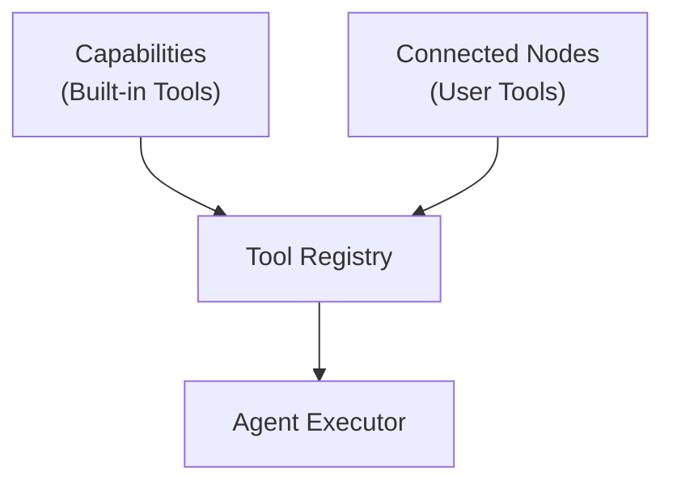
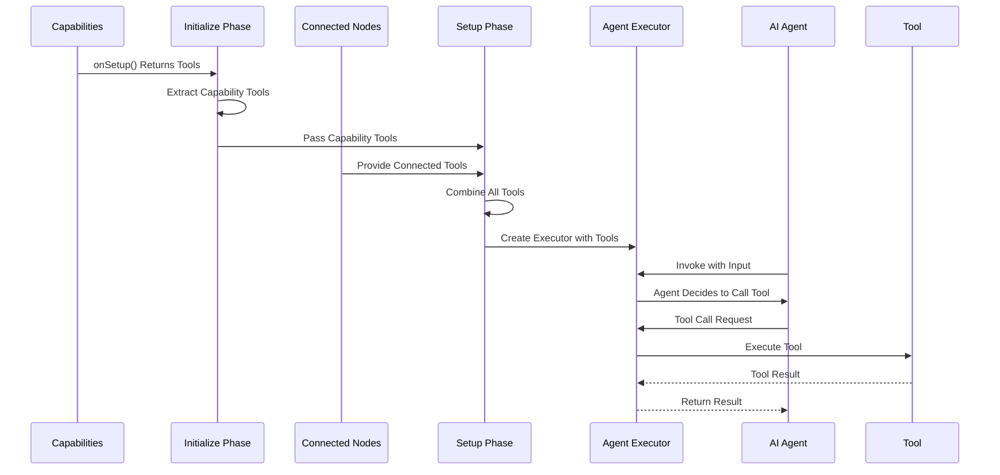
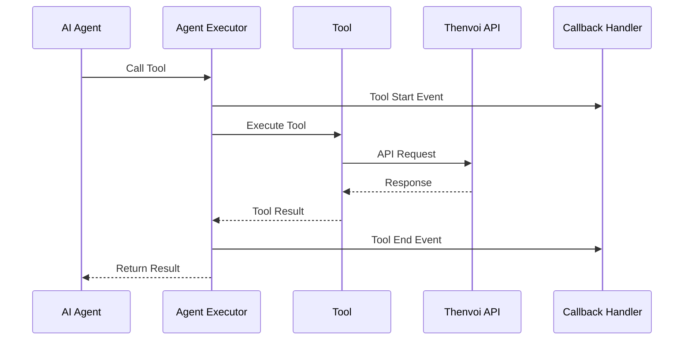
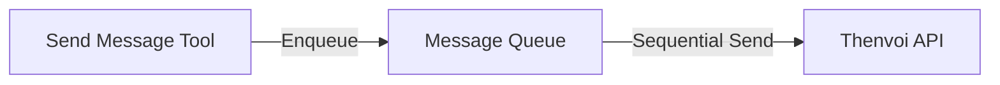

# Tool System Guide

## Overview

The tool system provides LangChain-compatible tools that enable AI agents to interact with the Thenvoi platform. Tools are provided by [capabilities](../../../glossary.md#capability) and connected nodes, collected during agent setup, and made available to the agent during execution.

The system supports built-in tools for messaging and collaboration, as well as custom tools from connected n8n nodes, enabling agents to perform actions beyond simple text generation.

## Architecture

### Tool Sources

### Tool Flow

## Key Concepts

### Tool Interface

All tools implement LangChain's `StructuredTool` interface:

- **name** - Unique tool identifier
- **description** - Tool description for LLM
- **_call()** - Tool execution method

### Built-in Tools

#### Send Message Tool

**Purpose**: Allows agents to send visible messages to chat participants.

**Features**:

- Validates message content is non-empty
- Detects @mentions from message text
- Validates at least one mention is present
- Queues messages for sequential sending
- Returns success/error status

**Usage**: Agents call this tool to communicate with users or other agents.

#### List Available Participants Tool

**Purpose**: Lists agents and users that can be added to the chat.

**Features**:

- Fetches available participants from API
- Filters to show only addable participants
- Returns formatted list with IDs, handles, and names

**Usage**: Agents use this to discover who they can add to the chat.

#### Add Participant Tool

**Purpose**: Adds an agent or user to the current chat.

**Features**:

- Validates participant ID exists
- Checks participant isn't already in chat
- Adds participant via API
- Updates internal participant lists
- Notifies messaging capability for mention detection

**Usage**: Agents use this to add specialized agents or users to the chat.

#### Remove Participant Tool

**Purpose**: Removes a participant from the current chat.

**Features**:

- Validates participant ID exists
- Checks participant is in chat
- Removes participant via API
- Updates internal participant lists

**Usage**: Agents use this to remove participants from the chat.

### Tool Registration

Tools are registered through a two-phase process:

1. **Initialize Capabilities Phase**: Capabilities provide tools via `onSetup()` returning `SetupResult.tools`
2. **Setup Phase**: Connected tools retrieved from node connections
3. **Tool Combination**: Connected tools combined with capability tools
4. **Tool Registration**: All tools passed to agent executor during creation

### Tool Execution

### [Tool Name Registry](../../../glossary.md#tool-name-registry)

A [tool name registry](../../../glossary.md#tool-name-registry) maps tool class names to their declared names:

**Purpose**: Enables correct tool name extraction from serialized tool objects.

**Why Needed**: LangChain serializes tools, and class names don't always match declared names.

**Usage**: Callback handlers use registry to identify tools from serialized objects.

## Integration Points

### Capability Integration

Capabilities provide tools through `onSetup()`:

1. **Initialize Capabilities Phase**: Capability creates tool instances and returns them in `SetupResult.tools`
2. **Tool Extraction**: Tools extracted from all capability setup results
3. **Setup Phase**: Capability tools passed to setup phase for combination with connected tools
4. **Registration**: All tools registered with executor during executor creation

See [Capability System Guide](../capabilities/capability_system_guide.md) for details.

### Execution Pipeline Integration

Tools integrate into the execution pipeline:

1. **Initialize Phase**: Capabilities provide tools
2. **Setup Phase**: Connected tools retrieved and combined
3. **Setup Phase**: All tools registered with executor
4. **Execute Phase**: Agent can call tools
5. **Callbacks**: Tool calls streamed via callbacks

See [Execution Pipeline Guide](../execution/execution_pipeline_guide.md) for details.

### Prompt Integration

Tools are formatted and injected into prompts:

1. **Setup Phase**: Tools collected
2. **Setup Phase**: Tools formatted with names and descriptions
3. **Prompt**: Tools section injected into system prompt

See [Prompt System Guide](../prompting/prompt_system_guide.md) for details.

## Tool Execution Details

### Message Queue Integration

The send_message tool uses a message queue:

### Mention Detection

The send_message tool detects mentions:

1. **Pattern Matching**: Finds @handle patterns in message text
2. **Participant Lookup**: Matches handles to participant list
3. **Validation**: Ensures at least one mention exists
4. **Metadata Creation**: Creates mention metadata for API

See [Message Processing Guide](../messaging/message_processing_guide.md) for details.

### Error Handling

Tools handle errors gracefully:

- **Validation Errors**: Return user-friendly error messages
- **API Errors**: Return formatted error responses
- **Tool Errors**: Logged but don't crash execution

**Error Format**: Tools return JSON strings with error details for the LLM.

## Custom Tools

### Adding Custom Tools

Custom tools can be added through:

1. **Connected Nodes**: Connect n8n AI Tool nodes
2. **Custom Capabilities**: Create capability that provides tools
3. **Tool Implementation**: Implement LangChain `StructuredTool` interface

### Tool Requirements

Custom tools must:

- Extend LangChain `StructuredTool`
- Implement `name`, `description`, and `_call()` methods
- Return string results (or JSON strings for complex data)
- Handle errors gracefully

## Related Documentation

- [Capability System Guide](../capabilities/capability_system_guide.md) - How capabilities provide tools
- [Execution Pipeline Guide](../execution/execution_pipeline_guide.md) - How tools are integrated
- [Prompt System Guide](../prompting/prompt_system_guide.md) - How tools are formatted in prompts
- [Message Processing Guide](../messaging/message_processing_guide.md) - How send_message tool works
- [Glossary](../../../glossary.md) - Definitions of domain-specific terms

## Troubleshooting

### Tool Not Available

- Verify tool is returned from capability `onSetup()`
- Check tool is properly instantiated
- Ensure tool extends LangChain `StructuredTool`
- Verify tool is registered with executor

### Tool Execution Failing

- Check tool validation logic
- Verify API requests are successful
- Ensure error handling returns user-friendly messages
- Check tool description is clear for LLM

### Tool Not Called by Agent

- Verify tool description is clear and specific
- Check tool is listed in available tools section
- Ensure LLM supports function calling
- Verify tool name matches description
