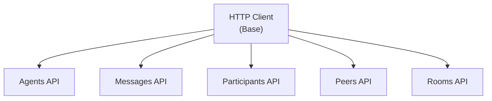
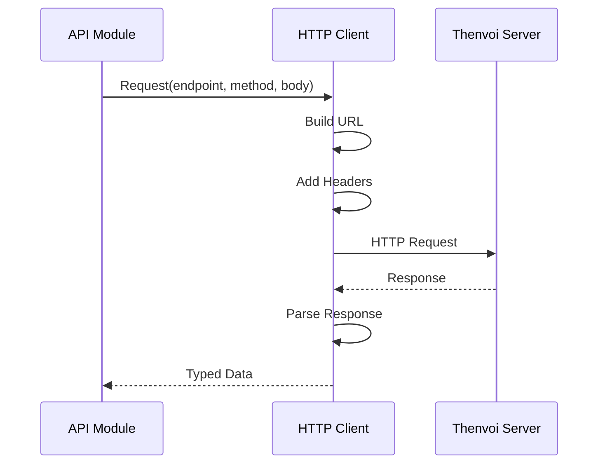
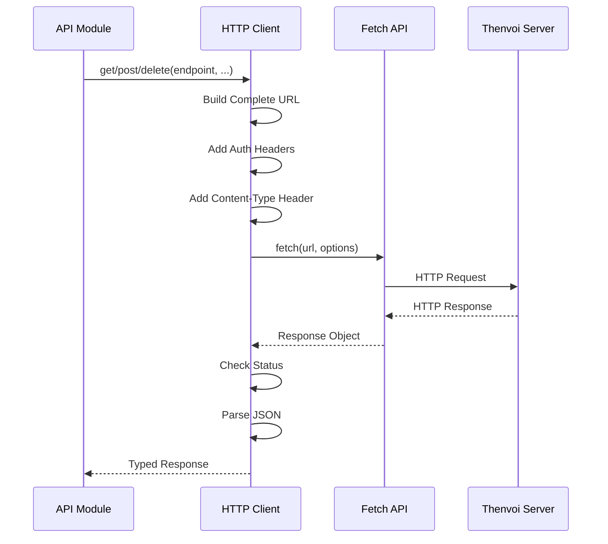
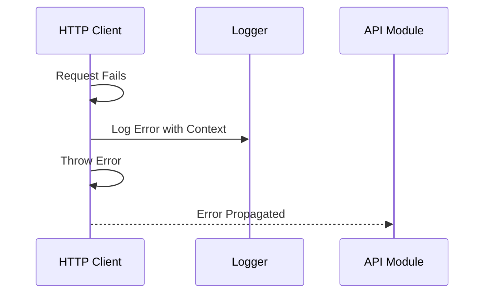

# API Client System Guide

## Overview

The API client system provides a unified interface for making HTTP requests to the Thenvoi API. It handles authentication, URL construction, error handling, and response parsing, abstracting HTTP complexity from the rest of the codebase.

The system is organized into domain-specific API modules (agents, messages, participants, peers, rooms) that use a shared HTTP client for consistent request handling.

## Architecture

### Client Organization

### Request Flow

## Data Flow

### HTTP Request Sequence

### Error Handling Flow

## Key Concepts

### HTTP Client

The base HTTP client provides:
- **URL Construction**: Builds complete URLs from endpoints
- **Authentication**: Adds API key header to all requests
- **Error Handling**: Centralized error logging and handling
- **Response Parsing**: Handles JSON parsing and 204 No Content responses

**Methods**:
- `get<T>(endpoint, params?)` - GET request with query parameters
- `post<T>(endpoint, body?)` - POST request with JSON body
- `delete<T>(endpoint)` - DELETE request

### API Modules

Domain-specific modules organize API endpoints:

#### Agents API
- Agent-related operations
- Agent discovery and information

#### Messages API
- Message creation and management
- Message status updates
- Event sending

#### Participants API
- Participant management
- Adding/removing participants from chats
- Listing current chat participants

#### Peers API
- Peer discovery (agents and users the agent can interact with)
- Filtering peers not in a specific chat
- Pagination support

#### Rooms API
- Room information
- Room listing and filtering

### URL Construction

**Base URL Format**:
- HTTP: `http://{serverUrl}/api/v1`
- HTTPS: `https://{serverUrl}/api/v1`

**Endpoint Formatting**:
- Endpoints are appended to base URL
- Query parameters added via URLSearchParams
- Full URL: `{baseUrl}{endpoint}?{params}`

### Authentication

**API Key Header**:
- Header name: `X-API-Key`
- Value: API key from credentials
- Added to all requests automatically

**Content-Type Header**:
- Header name: `Content-Type`
- Value: `application/json`
- Added to all requests

**Accept Header**:
- Header name: `accept`
- Value: `application/json`
- Added to all requests

### Response Handling

**Success Responses**:
- 200 OK: JSON parsed and returned
- 204 No Content: Returns `undefined`

**Error Responses**:
- Non-OK status: Error thrown with status and message
- Network errors: Error logged and thrown
- Parse errors: Error logged and thrown

### Error Handling

**Error Logging**:
- Errors logged with context (endpoint, method)
- Error details included in log
- Logging doesn't prevent error propagation

**Error Propagation**:
- Errors thrown to caller
- Caller handles errors appropriately
- No silent failures

## Integration Points

### Agent Node Integration

The agent node uses API client for:
- Fetching room information
- Fetching participants
- Fetching recent messages
- Sending messages and events
- Managing participants

### Trigger Node Integration

The trigger node uses API client for:
- Fetching available rooms
- Filtering rooms by criteria
- Room information retrieval

### Capability Integration

Capabilities use API client for:
- Messaging operations
- Participant management
- Room information

## API Endpoints

### Messages Endpoints

**POST /agent/chats/{chatId}/messages**:
- Creates a text message
- Requires mentions array (id; handle and name optional)
- Returns message data

**POST /agent/chats/{chatId}/events**:
- Creates an event message
- Supports various event types
- No mention validation

**POST /agent/chats/{chatId}/messages/{messageId}/processing**:
- Marks message as processing
- Creates processing attempt

**POST /agent/chats/{chatId}/messages/{messageId}/processed**:
- Marks message as processed
- Completes processing attempt

**POST /agent/chats/{chatId}/messages/{messageId}/failed**:
- Marks message as failed
- Completes processing attempt with error

**GET /agent/chats/{chatId}/messages**:
- Fetches recent messages
- Query parameters: page, page_size, status (pending, processing, processed, failed, all)
- Returns message array

### Participants Endpoints

**GET /agent/chats/{chatId}/participants**:
- Fetches participants currently in a chat
- Participants include id, name, type, role, handle, and optional description
- Returns participant array

**POST /agent/chats/{chatId}/participants**:
- Adds participant to chat
- Requires participant ID and role
- Returns participant data

**DELETE /agent/chats/{chatId}/participants/{participantId}**:
- Removes participant from chat
- Returns success status

### Peers Endpoints

**GET /agent/peers**:
- Fetches available peers (agents and users) for the authenticated agent
- Peers include handle, id, name, type, is_contact, source (registry or contact)
- Query parameters:
  - `not_in_chat`: Exclude peers already in a specific chat
  - `page`: Page number for pagination
  - `page_size`: Items per page (max: 100)
- Returns paginated peers response

### Rooms Endpoints

**GET /agent/chats/{chatId}**:
- Fetches room information
- Returns room data

**GET /agent/chats**:
- Fetches the authenticated agent's rooms
- Supports filtering
- Returns room array

## Related Documentation

- [Message Processing Guide](../agent/messaging/message_processing_guide.md) - How messages are sent
- [Tool System Guide](../agent/tools/tool_system_guide.md) - How tools use API client
- [Glossary](../../glossary.md) - Definitions of domain-specific terms

## Troubleshooting

### API Requests Failing

- Verify API key is correct
- Check server URL is correct
- Ensure HTTPS is enabled if required
- Check network connectivity

### Authentication Errors

- Verify API key header is added
- Check API key has required permissions
- Ensure credentials are properly configured
- Trigger initialization fails fast with `Invalid Thenvoi auth token (API key). Please verify your Thenvoi credentials.`
- Agent node authentication errors are surfaced during item execution with the same invalid-token message
- Authentication failures are detected from HTTP status (`401`/`403`) and websocket auth errors for consistent behavior across node types

### Response Parsing Errors

- Verify response is valid JSON
- Check for 204 No Content handling
- Ensure error responses are handled

### URL Construction Issues

- Verify server URL format
- Check endpoint paths are correct
- Ensure query parameters are properly encoded

