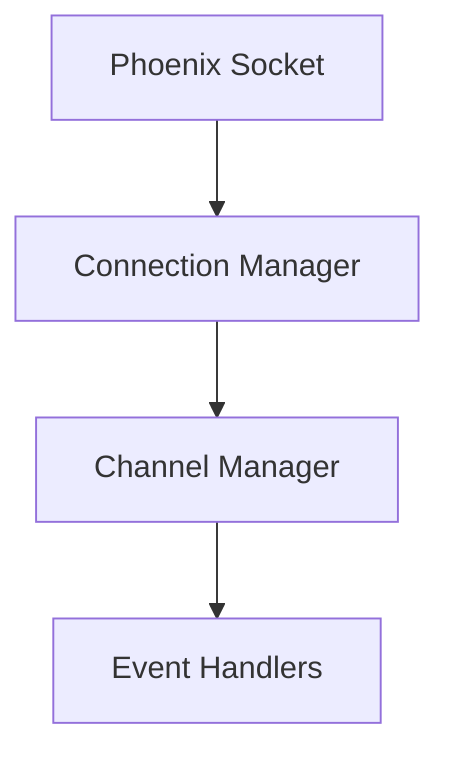
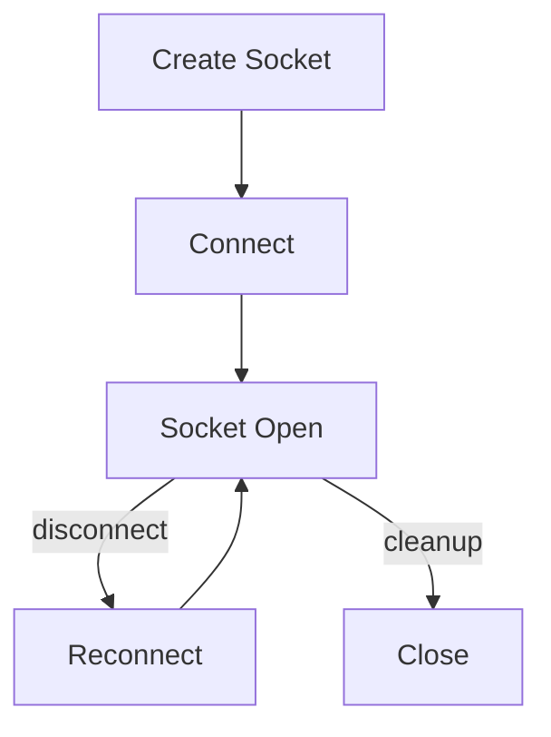
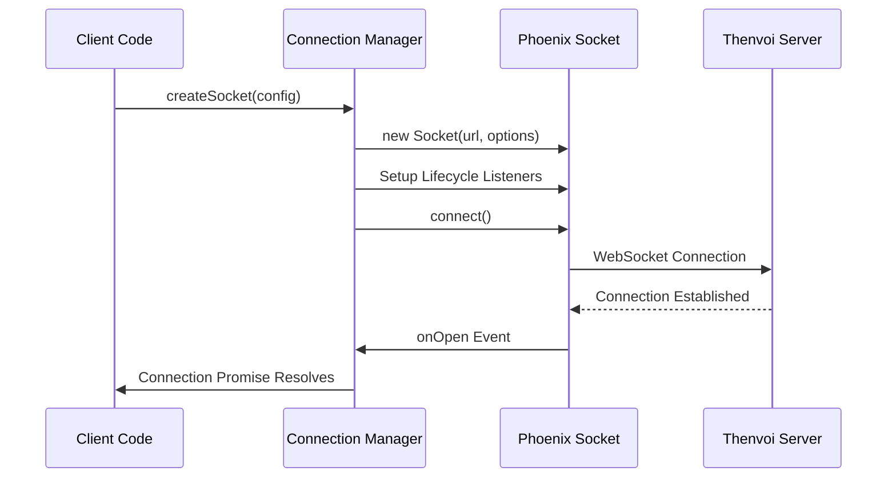
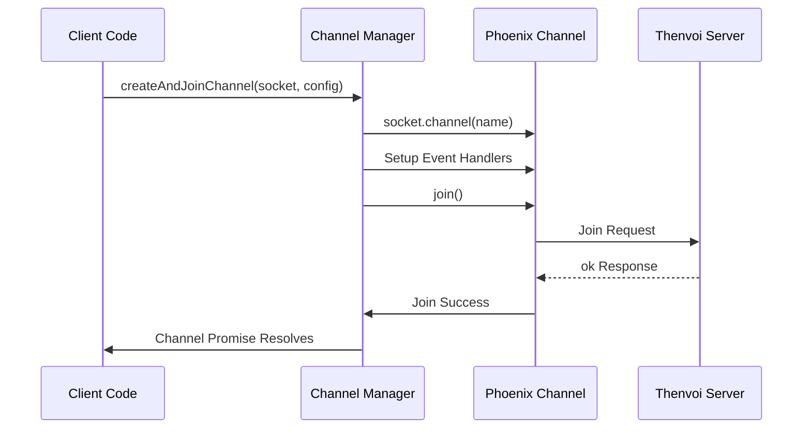
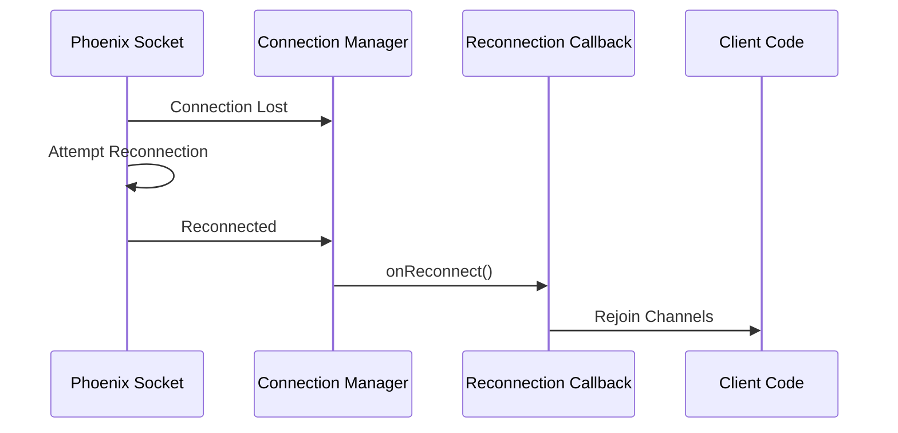
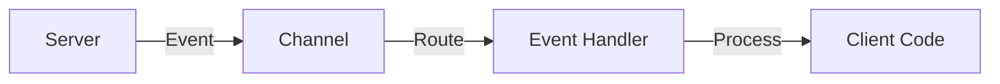
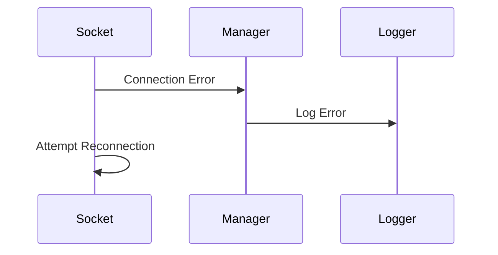

# Socket System Guide

## Overview

The socket system provides WebSocket connectivity to the Thenvoi platform using [Phoenix sockets](../../glossary.md#phoenix-socket). It manages connection lifecycle, channel subscriptions, reconnection handling, and event routing for real-time communication.

The system abstracts Phoenix socket complexity and provides a clean interface for creating connections, joining channels, and handling events with proper error handling and reconnection support.

## Architecture

### Socket Components

### Connection Lifecycle

## Data Flow

### Connection Sequence

### Channel Join Sequence

### Reconnection Sequence

## Key Concepts

### [Phoenix Socket](../../glossary.md#phoenix-socket)

[Phoenix sockets](../../glossary.md#phoenix-socket) provide:
- WebSocket connection management
- Automatic reconnection
- Channel-based messaging
- Event-based communication

**Configuration**:
- **URL**: WebSocket server URL (WSS for secure)
- **Params**: API key and agent ID for authentication
- **Logger**: Custom logger for socket events
- **Reconnection Strategy**: Function returning delay between attempts

### Socket Lifecycle

**States**:
1. **Created** - Socket instance created
2. **Connecting** - Connection attempt in progress
3. **Connected** - Socket open and ready
4. **Reconnecting** - Connection lost, attempting reconnect
5. **Closed** - Socket disconnected

**Events**:
- `onOpen` - Socket connection established
- `onClose` - Socket connection closed
- `onError` - Connection error occurred

### Channel Management

**Channel Types**:
- **chat_room:{roomId}** - Room-specific events
- **agent_rooms:{agentId}** - Agent-specific room management
- **room_participants:{roomId}** - Room participant events

**Channel Lifecycle**:
1. **Create** - Channel instance created from socket
2. **Join** - Join request sent to server
3. **Subscribed** - Join confirmed, receiving events
4. **Leave** - Leave channel, stop receiving events

**Join Process**:
- Join request sent with timeout
- Server responds with `ok`, `error`, or `timeout`
- Promise resolves on success, rejects on error/timeout

### Reconnection Strategy

**Default Strategy**: 5 minutes between all reconnection attempts

**Custom Strategy**: Function returning delay in milliseconds

**Reconnection Behavior**:
- Automatic reconnection on disconnect
- Reconnection callback triggered after reconnect
- Channels must be re-joined after reconnection

### Event Handling

**Event Registration**:
- Events registered when channel is created
- Handler functions receive raw event data
- Multiple events can be registered per channel

**Event Flow**:

## Integration Points

### Trigger Node Integration

The trigger node uses sockets for real-time event listening:

1. **Connection**: Creates socket on trigger initialization
2. **Channels**: Subscribes to room channels
3. **Events**: Routes events to handlers
4. **Reconnection**: Handles reconnection and re-subscription

See [Trigger System Guide](../trigger/trigger_system_guide.md) for details.

### Authentication

Socket authentication uses:
- **API Key**: Sent as `api_key` parameter
- **Agent ID**: Sent as `agent_id` parameter
- **Server Validation**: Server validates credentials on connection

### URL Construction

**WebSocket URL**:
- Constructed from server URL
- Uses WSS (secure WebSocket) protocol
- Format: `wss://{serverUrl}/socket`

## Error Handling

### Connection Errors

**Error Handling**:
- Connection errors logged but don't crash
- Automatic reconnection attempts
- Reconnection callback handles channel restoration

### Channel Join Errors

**Error Types**:
- **Error Response**: Server rejects join
- **Timeout**: Join request times out
- **Network Error**: Connection issue during join

**Error Handling**:
- Errors logged with context
- Promise rejects with error details
- Individual channel failures don't affect others

### Timeout Handling

**Connection Timeout**: 10 seconds
- Prevents indefinite waiting
- Provides clear error message
- Allows retry logic

**Channel Join Timeout**: 15 seconds (configurable)
- Prevents hanging joins
- Provides clear error message
- Allows retry logic

## Reconnection Details

### Reconnection Process

1. **Detection**: Socket detects disconnection
2. **Delay**: Wait based on reconnection strategy
3. **Reconnect**: Attempt new connection
4. **Callback**: Trigger reconnection callback
5. **Restore**: Client code restores channels

### Reconnection Callback

The reconnection callback:
- Receives no parameters
- Can be async
- Should restore channel subscriptions
- Errors are logged but don't prevent reconnection

### Channel Restoration

After reconnection:
- Old channel references are invalid
- Channels must be re-joined
- Event handlers must be re-registered
- Subscriptions must be restored

## Related Documentation

- [Trigger System Guide](../trigger/trigger_system_guide.md) - How trigger uses sockets
- [API Client Guide](../api/api_client_guide.md) - HTTP API for room data
- [Glossary](../../glossary.md) - Definitions of domain-specific terms

## Troubleshooting

### Connection Failing

- Verify server URL is correct
- Check API key and agent ID are valid
- Ensure WebSocket support is available
- Check network connectivity

### Channels Not Joining

- Verify channel name format is correct
- Check authentication credentials
- Ensure socket is connected before joining
- Verify server accepts channel join requests

### Events Not Received

- Verify event handlers are registered
- Check event names match server events
- Ensure channel is successfully joined
- Verify event data format matches expectations

### Reconnection Not Working

- Check reconnection callback is configured
- Verify callback handles errors gracefully
- Ensure channels are re-joined after reconnect
- Check reconnection strategy is appropriate

