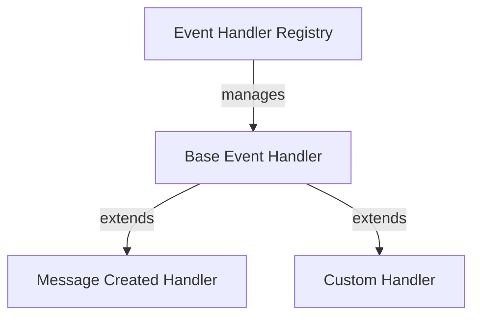
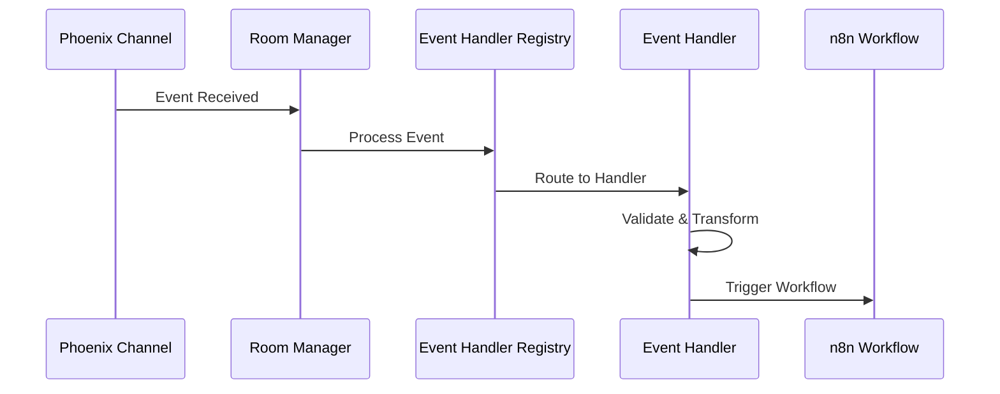

# Event Handler Guide

## Overview

The Event Handler system provides an extensible architecture for processing different event types from Thenvoi chat rooms. It routes events to appropriate handlers, validates event data, and triggers n8n workflows when conditions are met.

## Architecture



## Event Handler Registry

The Event Handler Registry manages all registered event handlers:

**Responsibilities**:
- Handler registration and discovery
- Event routing to appropriate handlers
- Providing available event types for configuration

**Registration**:
- Handlers register during module load
- Each handler must have a unique event type
- Registry provides available event types for n8n node configuration

## Handler Interface

All event handlers implement the `IEventHandler` interface:

**Required Properties**:
- `eventType` - Unique event identifier
- `displayName` - Display name for the event type
- `description` - Description of what this event handler does

**Required Methods**:
- `validateConfig(config, context)` - Validates configuration for this event handler
- `processEvent(rawData, config, context)` - Processes an incoming event
- `getEventSpecificParameters()` - Returns event-specific node parameters
- `shouldTriggerWorkflow(data, config, context)` - Determines if workflow should trigger
- `buildWorkflowPayload(data, config, context)` - Builds the enriched data payload

## Event-Specific Parameters

Event-specific parameters are n8n node properties that define custom configuration options for each event handler type. They allow event handlers to expose event-specific settings in the n8n node configuration UI.

### Purpose

Event-specific parameters enable:

- **Custom Configuration**: Each event handler can define its own configuration options
- **Dynamic UI**: Parameters are automatically added to the n8n node configuration form
- **Type Safety**: Parameters are typed and validated through the configuration system
- **Flexibility**: Different event types can have different configuration needs

### How They Work

1. **Definition**: Handlers define parameters using `getEventSpecificParameters()` which returns an array of `INodeProperties`
2. **Collection**: The Event Handler Registry collects parameters from all registered handlers
3. **UI Integration**: Parameters are combined with base parameters and displayed in the n8n node configuration
4. **Configuration**: Parameter values are read from the node configuration and added to the handler's config object
5. **Usage**: Handlers use these parameters in `shouldTriggerWorkflow()` and `buildWorkflowPayload()` methods

### Example Use Cases

Event-specific parameters can be used for:

- **Filtering Options**: Message type filters, content filters, user filters
- **Behavior Configuration**: Trigger conditions, response formatting options
- **Feature Flags**: Enable/disable specific features for an event type
- **Custom Settings**: Any event-specific configuration needed by the handler

### Parameter Structure

Parameters follow n8n's `INodeProperties` format:

```typescript
{
    displayName: 'Parameter Label',
    name: 'parameterName',
    type: 'string' | 'boolean' | 'options' | 'number' | ...,
    default: 'defaultValue',
    description: 'Parameter description',
    // ... other n8n property options
}
```

### Config Type Requirement

**Important**: When defining event-specific parameters, you must also create a custom config type that extends `TriggerConfig` and includes these parameter fields. The parameter `name` values must match the property names in your config type.

```typescript
export type CustomEventConfig = TriggerConfig & {
    event: 'custom_event';
    filterUserId?: string; // Must match the 'name' in getEventSpecificParameters()
};
```

This ensures type safety and allows TypeScript to properly type-check your handler methods.

## Base Event Handler

The `BaseEventHandler` abstract class provides common functionality:

**Features**:
- Base event data parsing
- Message type validation (optional)
- Configuration validation
- Error handling and logging
- Workflow triggering

**Abstract Methods** (must be implemented by subclasses):
- `shouldTriggerWorkflow()` - Determine if workflow should trigger
- `buildWorkflowPayload()` - Build workflow payload

**Optional Overrides**:
- `parseEventData()` - Custom event data parsing
- `validateCustomConfig()` - Custom configuration validation
- `getEventSpecificParameters()` - Event-specific parameters

## Event Processing Flow



### Processing Steps

1. **Event Reception**: Room Manager receives event from Phoenix channel
2. **Routing**: Event Handler Registry routes event to appropriate handler
3. **Parsing**: Handler parses raw event data into typed structure
4. **Validation**: Handler validates configuration and event data
5. **Filtering**: Handler determines if workflow should trigger based on conditions
6. **Payload Building**: Handler builds enriched payload for workflow
7. **Triggering**: Handler triggers n8n workflow with payload

## Creating Custom Handlers

To create a custom event handler:

1. **Define Event-Specific Config Type** (if using event-specific parameters):
```typescript
import { TriggerConfig } from '../../types/config';

// Define config type that extends TriggerConfig with event-specific properties
export type CustomEventConfig = TriggerConfig & {
    event: 'custom_event';
    filterUserId?: string; // Event-specific parameter
};
```

2. **Extend BaseEventHandler**:
```typescript
export class CustomEventHandler extends BaseEventHandler<CustomEventConfig, RawDataType, DataType> {
    readonly eventType = 'custom_event';
    readonly displayName = 'Custom Event';
    readonly description = 'Handles custom events';
    
    shouldTriggerWorkflow(data: DataType, config: CustomEventConfig, context: ITriggerFunctions): boolean {
        // Access event-specific parameters via config
        if (config.filterUserId && data.userId !== config.filterUserId) {
            return false;
        }
        // Custom logic to determine if workflow should trigger
    }
    
    buildWorkflowPayload(data: DataType, config: CustomEventConfig, context: ITriggerFunctions): any {
        // Build and return workflow payload
    }
}
```

3. **Add Event-Specific Parameters**:
```typescript
getEventSpecificParameters(): INodeProperties[] {
    return [
        {
            displayName: 'Filter by User',
            name: 'filterUserId',
            type: 'string',
            default: '',
            description: 'Only trigger for messages from this user ID',
        },
    ];
}
```

**Important**: When adding event-specific parameters, you must also update your config type to include these fields. The parameter names in `getEventSpecificParameters()` must match the property names in your config type. The values will automatically be read from the n8n node parameters and added to the config object.

4. **Register Handler**:
```typescript
eventHandlerRegistry.register(new CustomEventHandler());
```

These parameters will automatically appear in the n8n node configuration UI when this event type is selected. Their values will be available in the `config` parameter passed to `shouldTriggerWorkflow()` and `buildWorkflowPayload()`.

## Error Handling

### Event Processing Errors

- Handler errors logged but don't crash trigger
- Invalid events logged and skipped
- Workflow continues processing other events
- Errors include context (event type, raw data, handler name)

### Error Recovery

- Failed event processing doesn't affect other events
- Invalid configurations logged during validation
- Malformed event data skipped with logging

## Related Documentation

- [Trigger System Guide](./trigger_system_guide.md) - Overview of the trigger system
- [Room Manager Guide](./room_manager_guide.md) - Room subscription management
- [Glossary](../../glossary.md) - Definitions of domain-specific terms
