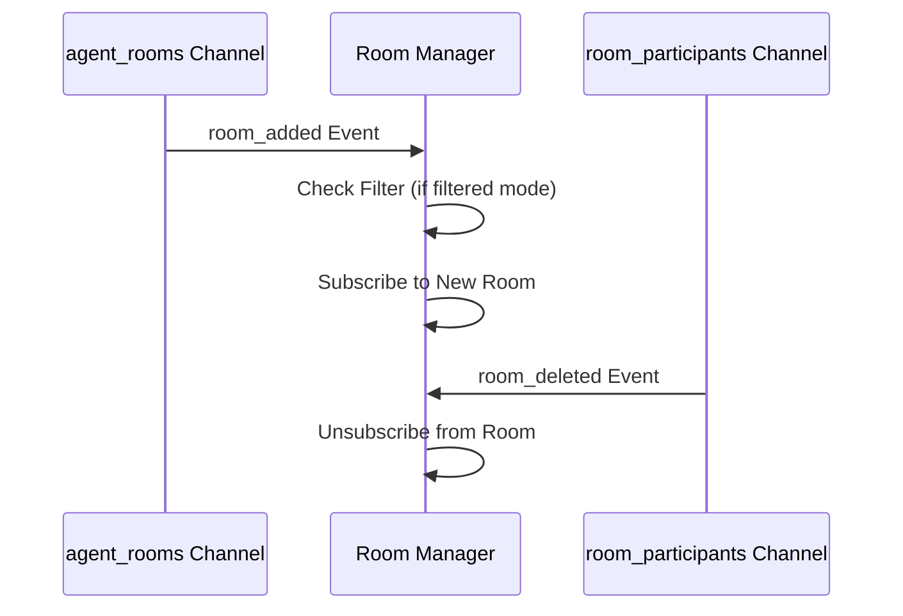
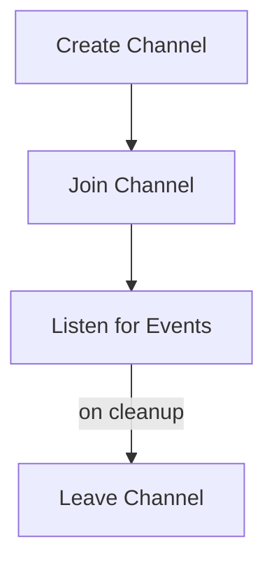
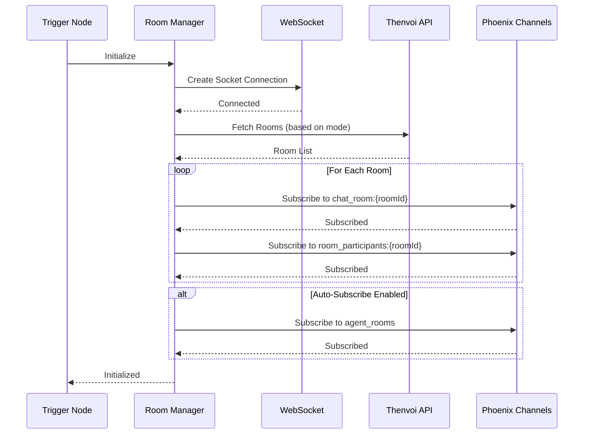
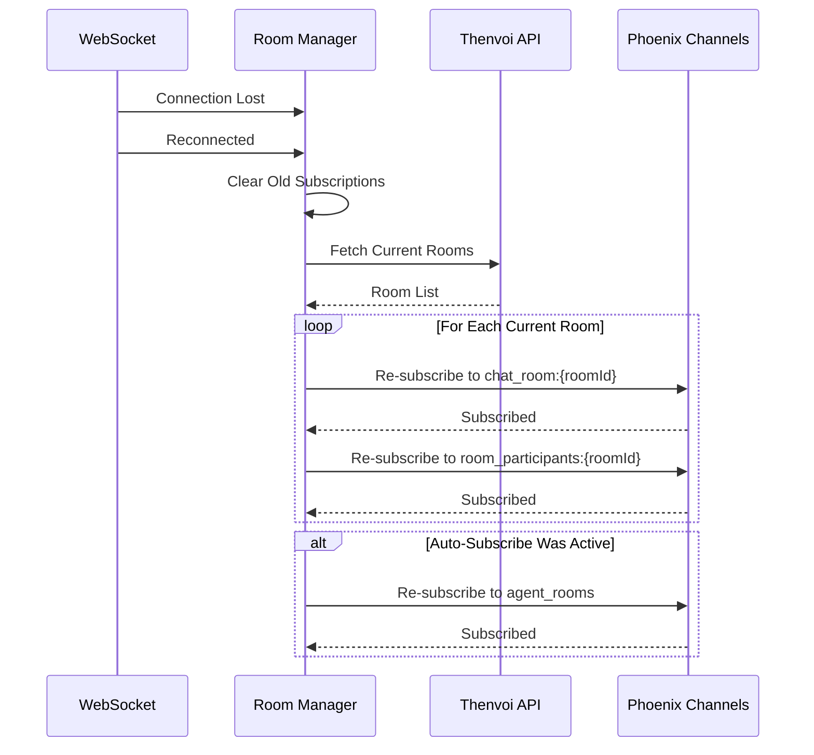
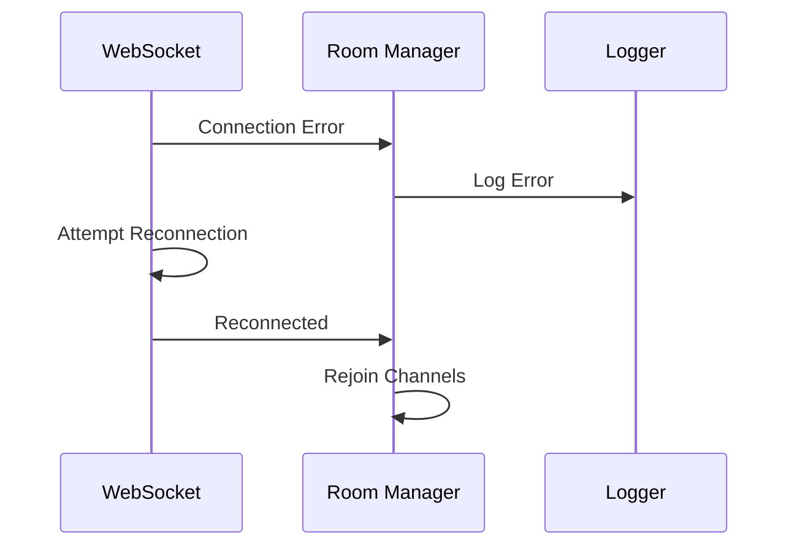

# Room Manager Guide

## Overview

The Room Manager is the central component of the Thenvoi Trigger system, responsible for managing all room subscriptions, WebSocket connections, and channel lifecycle. It handles room discovery, subscription management, auto-subscribe coordination, and reconnection logic.

## Responsibilities

The Room Manager handles:

- Socket connection lifecycle
- Room subscription management
- Auto-subscribe coordination
- Reconnection handling
- Event routing to the Event Handler Registry

## State Management

The Room Manager maintains:

- **Subscription map**: Tracks active subscriptions with channel references
- **isReconnecting flag**: Prevents concurrent reconnection attempts
- **Channel references**: Cleared on reconnection (invalid after disconnect)
- **Auto-subscribe state**: Tracks whether auto-subscribe is active

## Room Subscription Modes

The Room Manager supports three subscription modes:

### Single Room Mode

Subscribes to one specific chat room:

- Configure room ID directly
- Simple, focused subscription
- No auto-subscribe support

### All Rooms Mode

Subscribes to all rooms available to the agent:

- Fetches all rooms from API
- Subscribes to each room
- Optional auto-subscribe for new rooms

### Filtered Rooms Mode

Subscribes to rooms matching filter criteria:

- Regex pattern for room titles
- Optional auto-subscribe for matching new rooms
- Graceful fallback if regex is invalid

## Auto-Subscribe System

Auto-subscribe automatically manages subscriptions when the agent is added to or removed from chats:

**Components**:
1. **agent_rooms Channel** - Listens for `room_added` and `room_removed` events when the agent is added to or removed from a chat (only when auto-subscribe enabled)

**Flow**:

**Room Deletion Listeners**:
- `room_participants` channels are set up for **all subscribed rooms** (regardless of auto-subscribe)
- These channels listen for `room_deleted` events to clean up subscriptions when a chat that the agent is participating in is deleted
- This ensures proper cleanup even when auto-subscribe is disabled

**Why Two Channels**:
- `agent_rooms` provides `room_added`/`room_removed` events when the agent is added to or removed from a chat (auto-subscribe only)
- `room_participants` provides `room_deleted` events when a chat that the agent is participating in is deleted (always set up for all subscriptions)

## Room Subscription Details

### Channel Types

**chat_room:{roomId}**:
- Main channel for room events
- Receives message events
- One channel per room

**agent_rooms**:
- Agent-specific channel
- Receives `room_added`/`room_removed` events when the agent is added to or removed from a chat
- Only subscribed when auto-subscribe enabled

**room_participants:{roomId}**:
- Room-specific participants channel
- Receives `room_deleted` events when a chat that the agent is participating in is deleted
- One channel per subscribed room (always set up, independent of auto-subscribe)

### Subscription Lifecycle

### Filter Matching

For filtered rooms mode:

1. **Regex Matching**: Room title matched against regex pattern
2. **Fallback**: If regex invalid, falls back to substring matching
3. **Auto-Subscribe**: New rooms checked against filters

## Initialization Sequence

## Reconnection Strategy

### Reconnection Flow

### Reconnection Process

1. **Detection**: Socket detects disconnection
2. **Reconnection**: Socket automatically reconnects
3. **Callback**: Reconnection callback triggered
4. **Cleanup**: Old channel references cleared
5. **Resubscribe**: Current rooms fetched and re-subscribed (including room_participants channels)
6. **Restore**: Auto-subscribe channels (agent_rooms) restored if previously active

### State Management

- **isReconnecting flag**: Prevents concurrent reconnection attempts
- **Subscription map**: Tracks active subscriptions
- **Channel references**: Cleared on reconnection (invalid after disconnect)

## Error Handling

### Connection Errors

### Subscription Errors

- Channel join failures logged but don't stop trigger
- Individual room failures don't affect other rooms
- Reconnection attempts to restore subscriptions

## Related Documentation

- [Trigger System Guide](./trigger_system_guide.md) - Overview of the trigger system
- [Event Handler Guide](./event_handler_guide.md) - Event processing system
- [Socket System Guide](../socket/socket_system_guide.md) - WebSocket connection details
- [API Client Guide](../api/api_client_guide.md) - API requests for room data
- [Glossary](../../glossary.md) - Definitions of domain-specific terms

