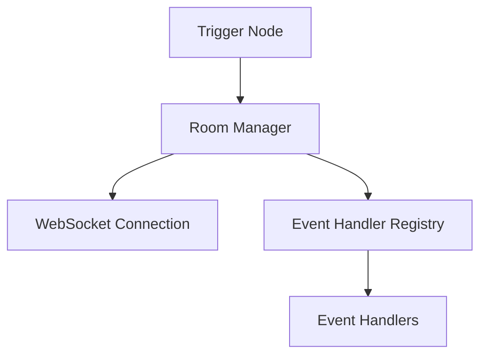
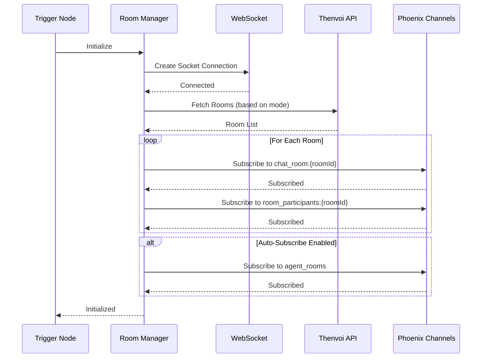
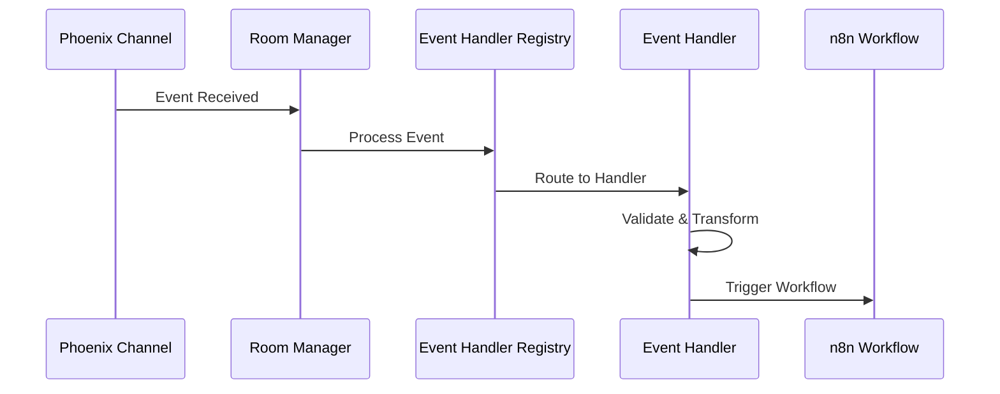
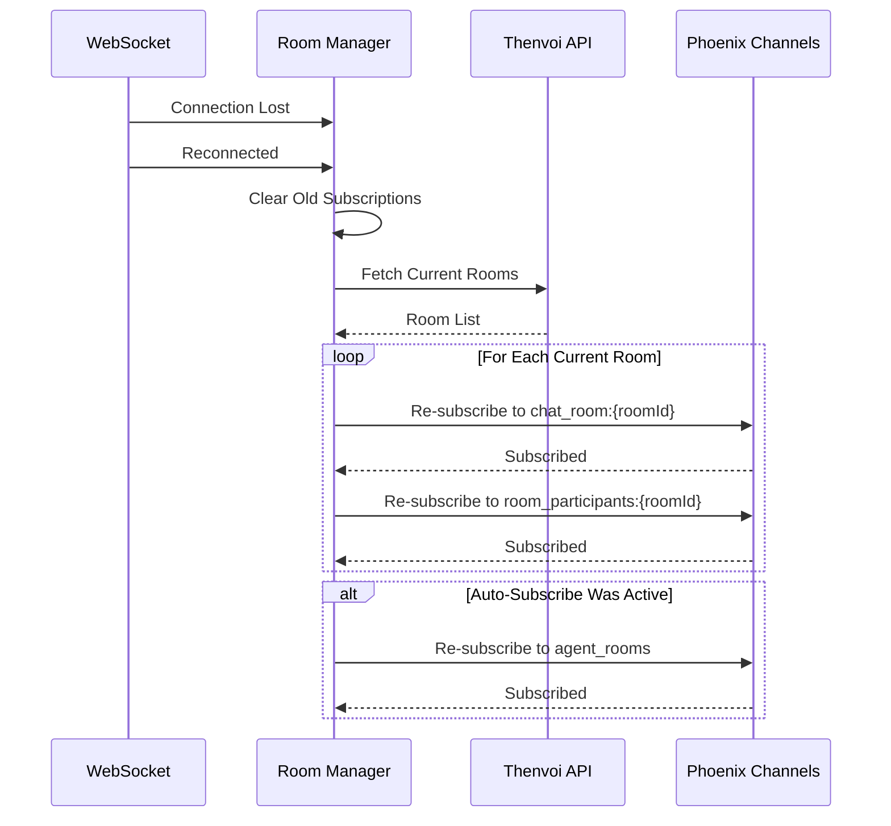

# Thenvoi Trigger System Guide

## Overview

The Thenvoi Trigger node listens to real-time events from Thenvoi chat rooms via WebSocket connections. It supports multiple [room subscription](../../glossary.md#room-subscription) modes (single room, all rooms, filtered rooms) and provides an extensible event handler system for processing different event types.

The trigger system manages WebSocket connections, room subscriptions, channel lifecycle, and event routing to provide reliable real-time event listening for n8n workflows.

## Architecture

### System Components

The trigger system consists of:

- **Room Manager**: Manages room subscriptions, WebSocket connections, and channel lifecycle
- **Event Handler Registry**: Routes events to appropriate handlers
- **Event Handlers**: Process and validate events, trigger workflows

See [Room Manager Guide](./room_manager_guide.md) and [Event Handler Guide](./event_handler_guide.md) for detailed information about each component.

## Data Flow

### Initialization Sequence

### Event Processing Flow

### Reconnection Flow

## Component Guides

### Room Manager

The Room Manager handles room subscriptions, auto-subscribe, and reconnection. See [Room Manager Guide](./room_manager_guide.md) for:

- Room subscription modes (single, all, filtered)
- Auto-subscribe system
- Channel types and lifecycle
- Reconnection strategy
- Error handling

### Event Handler System

The Event Handler system processes events and triggers workflows. See [Event Handler Guide](./event_handler_guide.md) for:

- Handler interface and architecture
- Event processing flow
- Creating custom handlers
- Error handling

## Integration Points

### WebSocket Integration

The trigger uses Phoenix sockets for real-time communication:

1. **Connection**: Creates socket with API key and agent ID
2. **Channels**: Subscribes to room-specific channels
3. **Events**: Listens for event messages
4. **Reconnection**: Handles automatic reconnection

See [Socket System Guide](../socket/socket_system_guide.md) for details.

### Event Handler Registration

Event handlers are registered in the event handler registry:

1. **Registration**: Handlers register during module load
2. **Discovery**: Registry provides available event types
3. **Routing**: Events routed to appropriate handler
4. **Processing**: Handler validates and processes events

See [Event Handler Guide](./event_handler_guide.md) for details.

### n8n Integration

The trigger integrates with n8n's trigger system:

1. **Initialization**: Trigger initializes on workflow activation
2. **Event Processing**: Events trigger workflow execution
3. **Output**: Handler formats event data for n8n
4. **Cleanup**: Trigger cleans up on workflow deactivation

## Troubleshooting

### Trigger Not Receiving Events

- Verify socket connection is established
- Check room subscriptions are active (see [Room Manager Guide](./room_manager_guide.md))
- Ensure event handler is registered (see [Event Handler Guide](./event_handler_guide.md))
- Verify room ID matches subscribed rooms

### Auto-Subscribe Not Working

- Verify auto-subscribe is enabled in configuration
- Check agent_rooms channel is subscribed
- Verify filter criteria if using filtered mode
- Note: room_participants channels are always set up (independent of auto-subscribe) for room deletion cleanup

See [Room Manager Guide](./room_manager_guide.md) for more details on auto-subscribe.

### Reconnection Issues

- Check reconnection callback is configured
- Verify rooms are re-fetched after reconnection
- Ensure channel references are cleared
- Check for concurrent reconnection attempts

See [Room Manager Guide](./room_manager_guide.md) for reconnection details.

### Event Handler Not Processing

- Verify handler is registered in registry
- Check event type matches handler
- Ensure handler implements all required methods
- Verify event data format matches expectations

See [Event Handler Guide](./event_handler_guide.md) for handler troubleshooting.

## Related Documentation

- [Room Manager Guide](./room_manager_guide.md) - Room subscription management
- [Event Handler Guide](./event_handler_guide.md) - Event processing system
- [Socket System Guide](../socket/socket_system_guide.md) - WebSocket connection details
- [API Client Guide](../api/api_client_guide.md) - API requests for room data
- [Glossary](../../glossary.md) - Definitions of domain-specific terms
