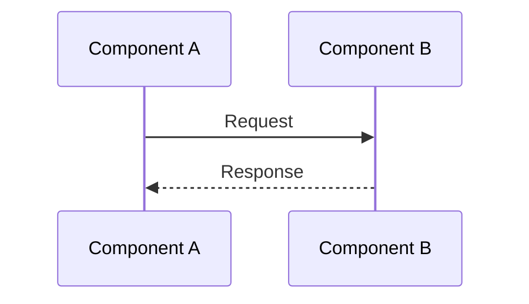
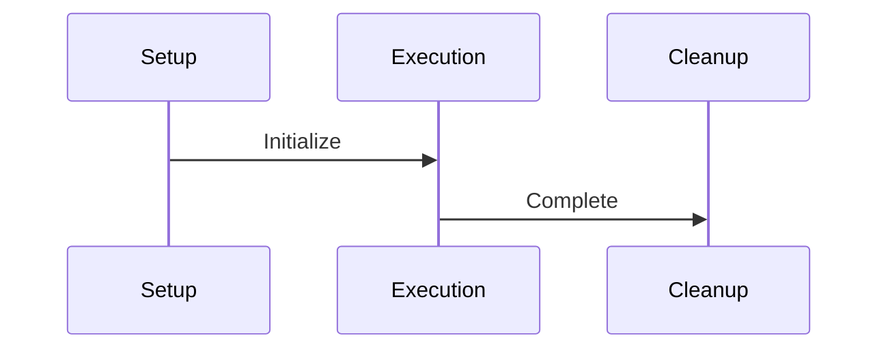

# Documentation Guide

## Overview

This guide explains how to create effective, maintainable documentation for the Thenvoi n8n nodes project. It's based on best practices learned from creating system documentation and focuses on creating documentation that remains accurate even as code evolves.

## Documentation Location

Documentation is organized by purpose and scope:

- **`/docs/architecture/`** - System-level architecture documentation
  - Cross-cutting concerns and design patterns
  - High-level system design
  - Component relationships and interactions
  - Example: `/docs/architecture/memory/memory_system_guide.md`

- **`/docs/nodes/`** - Per-node conceptual descriptions
  - Node-specific architecture and behavior
  - Node configuration and capabilities
  - Node integration patterns
  - Example: `/docs/nodes/agent/agent_node_guide.md`

- **`/docs/plans/`** - Planning documents and discussions
  - Design discussions and analysis documents
  - Implementation plans and task lists
  - Refactoring plans and simplification proposals
  - Integration implementation tasks
  - Example: `/docs/plans/memory-system-redesign-discussion.md`

- **`/docs/`** (root) - Project-wide documentation
  - Guides and standards (like this file)
  - Cross-project documentation

When creating new documentation, place it in the appropriate directory based on its scope and purpose.

## When to Create New Documentation

Create new documentation when:
- Documenting a new system component or feature
- The topic requires its own focused guide (follows the structure template)
- The content doesn't fit naturally into existing documents

Update existing documentation when:
- Adding new concepts to an existing system
- Clarifying or expanding existing explanations
- Fixing inaccuracies or outdated information

**Rule of thumb:** If you're adding a new section that's 200+ lines or fundamentally changes the document's focus, consider creating a new document instead.

## Core Principles

### 1. Focus on Concepts, Not Code

**Avoid:**
- Detailed code snippets that will become outdated
- Exact function signatures and implementations
- Step-by-step code walkthroughs

**Instead:**
- Explain the architecture and design patterns
- Describe what the system does and why
- Use conceptual examples and diagrams
- Focus on behavior and flow, not implementation details

**Example:**

❌ **Bad:**
```typescript
async saveEnhancedContext(intermediateSteps: IntermediateStep[]) {
    const combinedInput = this.pendingSaves[0].inputValues;
    const combinedOutput = this.combineOutputs(this.pendingSaves);
    // ... more code
}
```

✅ **Good:**
After execution completes, the system combines all accumulated saves, extracts agent thoughts and tool calls, creates structured data, and saves it to base memory with enriched metadata.

### 2. Use Visual Diagrams

Mermaid diagrams are excellent for visualizing:
- Architecture and relationships
- Data flow and sequences
- System components and their interactions

**Best Practices:**
- Keep diagrams focused and readable
- Break large diagrams into smaller, focused ones
- Use colors meaningfully (e.g., different colors for different component types, highlight important paths)
- Test diagrams for parse errors
- Use appropriate diagram types:
  - `sequenceDiagram` for temporal flows
  - `graph` for relationships
  - `classDiagram` for data structures

**Example:**



### 3. Structure for Clarity

Organize documentation with clear sections:

1. **Overview** - High-level explanation
2. **Architecture** - System design and patterns
3. **Data Flow** - How information moves through the system
4. **Key Concepts** - Important ideas and decisions
5. **Integration Points** - Where things connect (conceptually)
6. **Examples** - Conceptual examples, not code
7. **Troubleshooting** - Common issues and solutions

### 4. Keep Type Information

Type definitions are relatively stable and help understanding:

**Good to include:**
- Data structure diagrams showing relationships
- Conceptual type descriptions (what fields mean, not exact syntax)
- Example data structures

**Avoid:**
- Exact TypeScript interface syntax (unless it's a public API)
- Implementation details of types

### 5. Explain the "Why"

Don't just describe what happens—explain why:

- Why was this design chosen?
- What problem does it solve?
- What are the trade-offs?
- What are the benefits?

### 6. Use Conceptual Examples

Show examples of:
- Data structures and their relationships
- System behavior and flows
- Use cases and scenarios

Avoid:
- Exact code implementations
- Step-by-step code instructions
- Function-by-function walkthroughs

### 7. Documentation Tone & Style

Maintain consistency across all documentation:

- **Use neutral, concise language** - Clear and direct, avoiding unnecessary words
- **Prefer short paragraphs** - Break up long blocks of text for readability
- **Avoid chronological storytelling** - Don't use "First, the system..." unless describing an actual sequence
- **Prefer diagrams to long explanations** - Visual representations are often clearer than text
- **Avoid passive voice where possible** - Active voice is clearer and more direct

This helps maintain consistency between contributors and makes documentation easier to read and maintain.

### 8. Audience Targeting

Documentation often fails because the author doesn't know their audience. For this project:

**Target Audience for Code Documentation:**
- **Maintainers and Contributors** - People who will modify or extend the codebase
- Assume readers understand TypeScript but not this specific system
- Focus on system-specific concepts, not general programming

**Guideline:** Write documentation assuming the reader understands TypeScript but not this system. This helps avoid both oversimplification and overcomplexity.

When documenting:
- Explain domain-specific concepts and terminology
- Clarify design decisions and trade-offs
- Don't explain basic TypeScript or programming concepts
- Focus on "why" this system works the way it does, not "how" to program

## Mermaid Diagram Guidelines

### Keep Diagrams Simple

**Avoid:**
- Overly complex diagrams with too many participants
- Random or meaningless colors
- Subgraphs that cause parse errors

**Prefer:**
- Focused diagrams showing one concept
- Meaningful colors (e.g., same color for related components, different colors for different types)
- Simple, clear relationships
- Colors that enhance understanding, not distract

### Break Large Diagrams Apart

If a diagram is hard to read:
- Split it into multiple smaller diagrams
- Each diagram should focus on one phase or concept
- Use sequence diagrams for temporal flows
- Use graph diagrams for relationships

### Test for Parse Errors

Common issues:
- Nodes referenced in styles that don't exist
- Subgraphs with nodes referenced outside
- Special characters in labels (use quotes)

**Solution:** Simplify the diagram structure.

## Documentation Structure Template

```markdown
# [System Name] Guide

## Overview
Brief explanation of what the system does and why it exists.

## Architecture
- High-level design
- Key components
- Design patterns used

## Data Flow
- How information moves through the system
- Key phases or stages
- Sequence diagrams for temporal flows

## Key Concepts
- Important ideas
- Design decisions
- Rationale

## Integration Points
- Where the system connects with others
- Conceptual integration, not code

## Related Documentation
- Links to related guides and documentation
- Cross-references to related systems

## Examples
- Conceptual examples
- Use cases
- Scenarios

## Troubleshooting
- Common issues
- How to diagnose problems
- Solutions
```

## Glossaries & Naming Conventions

Domain-specific terms are defined in the [central glossary](/docs/glossary.md). Use these terms consistently across all documentation.

**Guidelines:**
- **Use the central glossary** - All shared domain terms are defined in `/docs/glossary.md`
- **Link to glossary** - When using terms defined in the glossary, link to it for clarity
- **Per-document definitions** - Only define terms in individual documents if they are:
  - Specific to that document and not used elsewhere
  - Need document-specific context or nuance
  - Are temporary or experimental concepts
- **Update central glossary first** - When introducing new shared terms, add them to `/docs/glossary.md` first

This approach prevents terminology drift and ensures all contributors use the same language while allowing flexibility for document-specific terms.

## Cross-Referencing

When linking between documents:
- **Link to related concepts** - When mentioning systems or components documented elsewhere, link to those documents
- **Use descriptive link text** - `[memory system](architecture/memory/memory_system_guide.md)` not just `[here](...)`
- **Link to glossary terms** - When using domain terms, link to the glossary: [Base Memory](glossary.md#base-memory)
- **Avoid circular references** - If two documents need to reference each other, ensure each link serves a clear purpose

## Versioning Documentation

Keep documentation aligned with the current codebase:

- **Only document features that exist in the current version** - Don't document planned or future features unless they're actively in progress
- **Avoid "Future work" sections** - Unless work is actively in progress, don't document future plans (they become outdated quickly)
- **When removing a feature, update docs in the same PR** - Documentation changes should accompany code changes

This keeps docs aligned with code and prevents confusion about what's currently available.

## Documenting Deprecated Features

When a feature is deprecated:
- **Mark clearly** - Use `⚠️ DEPRECATED:` prefix or similar clear marking
- **Explain migration path** - Document how to move from old to new approach
- **Set removal timeline** - If known, document when the feature will be removed
- **Update in same PR** - Documentation changes should accompany deprecation code changes
- **Remove when feature is removed** - Don't leave deprecated sections indefinitely

## What to Include

### ✅ Good Content

- Architecture and design patterns
- Data flow and system behavior
- Conceptual explanations
- Visual diagrams
- Type structures (conceptually)
- Design rationale
- Integration points (conceptually)
- Troubleshooting guidance

### ❌ Avoid

- Detailed code snippets
- Exact function implementations
- Step-by-step code walkthroughs
- Implementation details that change frequently
- Exact API signatures (unless documenting public API)
- Code that will become outdated

## Documenting Configuration

When documenting configuration options:
- **Focus on behavior, not implementation** - Explain what each option does, not how it's coded
- **Use conceptual examples** - Show example values and their effects
- **Group related options** - Organize by feature or purpose, not alphabetically
- **Explain dependencies** - Note when options depend on or conflict with others
- **Document defaults** - Explain default behavior and when to change it

## Documenting Error Conditions

When documenting how systems handle errors:
- **Focus on behavior, not code** - Describe what happens, not try/catch blocks
- **Explain recovery strategies** - How the system handles failures
- **Document edge cases conceptually** - What happens at boundaries or limits
- **Use troubleshooting section** - Common errors go in the Troubleshooting section
- **Explain user-visible vs internal errors** - Distinguish what users see vs internal handling

## Documentation Longevity

To keep documentation accurate and maintainable, follow these guidelines:

- **Mark sections that are "likely to change"** - If something is unstable, note it explicitly
- **Avoid specific filenames or paths when they aren't stable** - Use conceptual descriptions instead
- **When documenting an API, describe behavior more than return values** - Behavior is more stable than exact structures
- **Use `IMPORTANT:` or `NOTE:` blocks sparingly but intentionally** - Reserve them for critical information that readers must not miss
- **Document patterns, not specific implementations** - "The system validates input before processing" is more stable than "The `validateInput()` function checks..."
- **Avoid version numbers in examples** - Unless documenting version-specific behavior, avoid "v1.2.3" in examples

These rules help documentation remain accurate even as implementation details change.

## Maintenance Tips

1. **Review periodically** - Check if examples still match current behavior
2. **Update when architecture changes** - Keep diagrams and concepts current
3. **Remove outdated details** - Don't let documentation drift from reality
4. **Keep it conceptual** - Focus on stable concepts, not changing implementations
5. **Update docs in the same PR as code changes** - When removing or changing features, update documentation immediately

## Documentation Review

Before merging documentation:
- **Technical accuracy** - Verify concepts match current implementation
- **Completeness** - Ensure all important aspects are covered
- **Clarity** - Ask someone unfamiliar with the system to review
- **Link validation** - Check that all internal links work
- **Diagram testing** - Verify Mermaid diagrams render correctly
- **Glossary consistency** - Ensure terms match glossary definitions

## Example: Good Documentation

```markdown
## Data Flow

The system processes requests through three phases:

1. **Setup Phase**: Components are initialized and configured
2. **Execution Phase**: The main processing happens
3. **Cleanup Phase**: Resources are released



This design ensures proper resource management and allows for clean error handling.
```

## Example: Bad Documentation

```markdown
## Data Flow

Here's the exact code:

```typescript
async function process() {
    await setup();
    await execute();
    await cleanup();
}
```

The setup function does:
```typescript
async function setup() {
    this.config = await loadConfig();
    this.resources = await allocateResources();
}
```
```

## Checklist

Before finalizing documentation:

- [ ] No detailed code snippets (only conceptual examples)
- [ ] Diagrams are simple and readable
- [ ] Focus is on "what" and "why", not "how"
- [ ] Type information is conceptual, not exact syntax
- [ ] Examples illustrate concepts, not implementations
- [ ] Diagrams tested for parse errors
- [ ] Structure is clear and logical
- [ ] Design rationale is explained
- [ ] Tone and style are consistent
- [ ] Target audience is clear
- [ ] Key terms link to [glossary.md](glossary.md) when appropriate
- [ ] Documentation matches current codebase version
- [ ] No "future work" sections unless actively in progress
- [ ] All internal links are valid and working
- [ ] Cross-references to related documentation are included
- [ ] Configuration options are documented (if applicable)
- [ ] Error conditions and edge cases are documented (if applicable)

## Summary

Good documentation:
- Explains concepts and architecture
- Uses visual diagrams effectively
- Focuses on stable, high-level ideas
- Remains accurate as code evolves
- Helps readers understand the system

Bad documentation:
- Contains detailed code that becomes outdated
- Focuses on implementation details
- Requires constant updates
- Becomes inaccurate quickly
- Doesn't help understanding

Remember: **Document the system, not the code.**

