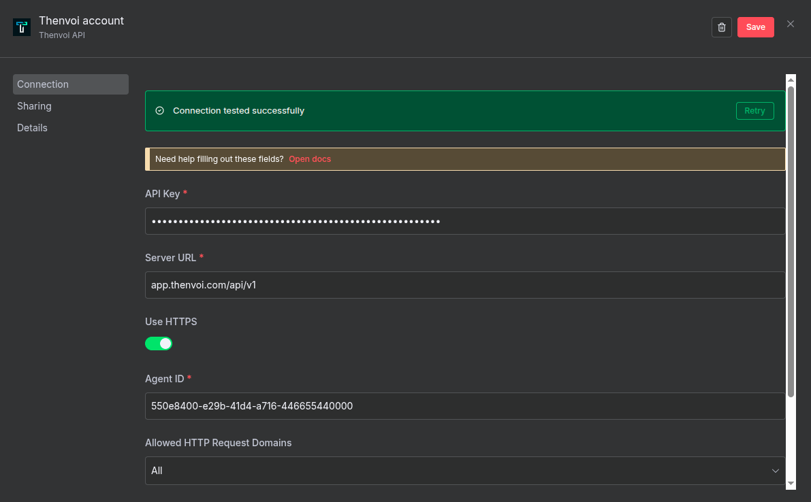

# Band Credentials Setup Guide

Use this guide to configure the shared **Band API** credential used by both:

- `Band Trigger`
- `Band AI Agent`

## Prerequisites

Before creating the credential, make sure you have:

1. A Band account
2. A Band API key
3. An agent created in Band
4. A self-hosted n8n instance

## Create the credential in n8n

1. In n8n, go to **Credentials** -> **New Credential**
2. Search for **Band API**
3. Fill in the fields below
4. Use **Test** to validate the connection
5. Save the credential

## Credential fields

### API Key

- **Source**: Band settings -> API Keys
- **Format**: Usually starts with `thnv_`

### Server URL

- **Value**: Band server base URL without protocol
- **Default**: `app.band.ai/api/v1`
- **Important**: Do not include `http://` or `https://`

### Use HTTPS

- **Default**: `true`
- Disable only if your server does not support HTTPS

### Agent ID

- **Source**: Band -> Agents
- **Format**: UUID
- Must match the agent used by your workflow
