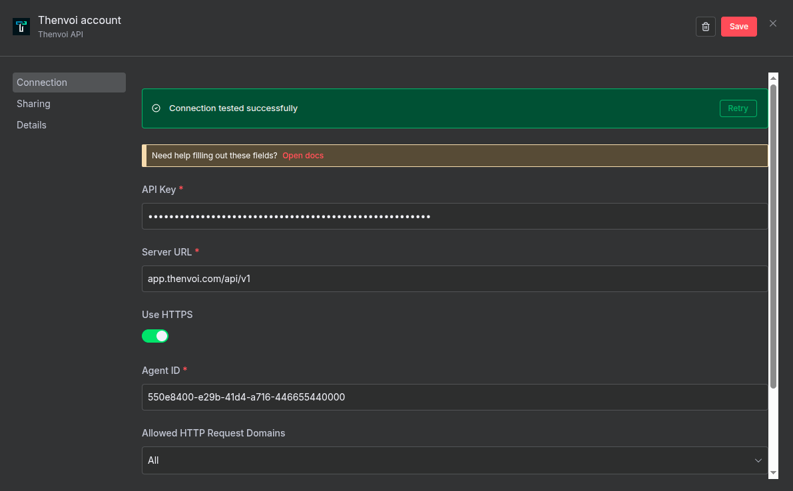
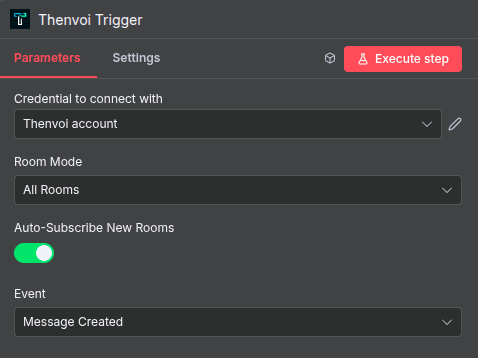
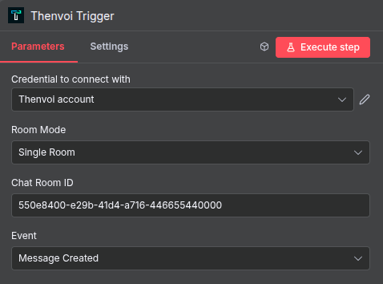
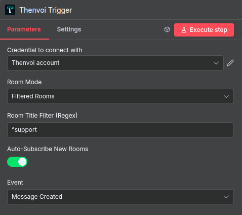
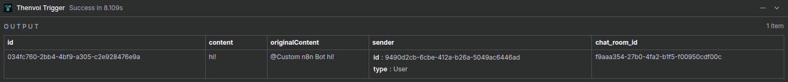

# Thenvoi Trigger Node - User Guide

Welcome! This guide will help you set up and configure the Thenvoi Trigger node to listen to real-time events from Thenvoi chat rooms.

## Table of Contents

1. [What is the Thenvoi Trigger Node?](#what-is-the-thenvoi-trigger-node)
2. [Prerequisites](#prerequisites)
3. [Setting Up Credentials](#setting-up-credentials)
4. [Node Configuration](#node-configuration)
5. [Room Modes](#room-modes)
6. [Event Types](#event-types)
7. [Best Practices](#best-practices)
8. [Example Workflows](#example-workflows)
9. [Troubleshooting](#troubleshooting)

---

## What is the Thenvoi Trigger Node?

The Thenvoi Trigger node allows you to:

- **Listen to real-time events** from Thenvoi chat rooms via WebSocket connections
- **Monitor multiple rooms** using different subscription modes
- **Filter events** based on your specific needs
- **Automatically subscribe** to new rooms as they are created
- **Trigger n8n workflows** when events occur in your chat rooms

Think of it as a real-time event listener that connects your Thenvoi chat rooms to your n8n automation workflows.

---

## Prerequisites

Before using the Thenvoi Trigger node, you need:

1. **Thenvoi Platform Access**: An account on a Thenvoi server
2. **API Credentials**: API key from your Thenvoi account
3. **Agent Created**: An agent created in the Thenvoi platform
4. **n8n Instance**: Access to an n8n instance (cloud or self-hosted)

---

## Setting Up Credentials

### Step 1: Create Thenvoi API Credentials in n8n

1. In n8n, go to **Credentials** → **New Credential**
2. Search for **"Thenvoi API"**
3. Fill in the required fields:

#### API Key
- **Where to get it**: Your Thenvoi platform settings → API Keys section
- **Format**: Usually starts with `thnv_`
- **Example**: `thnv_1234567890_abcdefghijklmnop`

#### Server URL
- **What it is**: The base URL of your Thenvoi server (without protocol)
- **Default**: `app.thenvoi.com/api/v1`
- **Note**: Don't include `http://` or `https://`

#### Use HTTPS
- **Default**: `true` (recommended)
- **When to disable**: Only if your Thenvoi server doesn't support HTTPS (rare)

#### Agent ID
- **Where to get it**: Your Thenvoi platform → Agents section
- **Format**: UUID (e.g., `550e8400-e29b-41d4-a716-446655440000`)
- **Important**: This must match the agent you want this n8n workflow to use

4. **Test the connection** using the built-in test button
5. **Save** the credential



---

## Node Configuration

### Required Parameters

| Parameter | Description | Notes |
|-----------|-------------|-------|
| **Event** | The type of event to listen for | Currently supports "Message Created" |
| **Room Mode** | How to select which rooms to listen to | See [Room Modes](#room-modes) section below |

### Room Mode Specific Parameters

The parameters available depend on the selected Room Mode:

#### Single Room Mode
- **Chat Room ID** (Required): The ID of the specific chat room to listen to

#### All Rooms Mode
- **Auto-Subscribe New Rooms** (Optional): Automatically subscribe to new chat rooms as they are created (default: enabled)

#### Filtered Rooms Mode
- **Room Title Filter (Regex)** (Required): Regex pattern to filter rooms by title
- **Auto-Subscribe New Rooms** (Optional): Automatically subscribe to new matching rooms as they are created (default: enabled)



---

## Room Modes

The trigger node supports three different modes for selecting which rooms to monitor:

### Single Room Mode

**Best for**: Monitoring a specific, known chat room

**Configuration**:
- Select **Room Mode**: "Single Room"
- Enter **Chat Room ID**: The UUID of the room you want to monitor

**Use Cases**:
- Monitoring a specific support channel
- Listening to a dedicated project room
- Tracking events in a known chat room

**Example**:
```
Room Mode: Single Room
Chat Room ID: 550e8400-e29b-41d4-a716-446655440000
```



### All Rooms Mode

**Best for**: Monitoring all rooms your agent has access to

**Configuration**:
- Select **Room Mode**: "All Rooms"
- **Auto-Subscribe New Rooms** (optional): Enable to automatically listen to new rooms as they are created

**Use Cases**:
- Monitoring all conversations across your organization
- Listening to all rooms your agent participates in
- Catching events from any room without filtering

**Example**:
```
Room Mode: All Rooms
Auto-Subscribe New Rooms: ✓ Enabled
```


### Filtered Rooms Mode

**Best for**: Monitoring multiple rooms that match a pattern

**Configuration**:
- Select **Room Mode**: "Filtered Rooms"
- Enter **Room Title Filter (Regex)**: A regex pattern to match room titles
- **Auto-Subscribe New Rooms** (optional): Enable to automatically listen to new matching rooms

**Regex Filter Examples**:

| Pattern | Matches |
|---------|---------|
| `^support` | Rooms starting with "support" (e.g., "support-team", "support-general") |
| `team$` | Rooms ending with "team" (e.g., "dev-team", "sales-team") |
| `bug\|issue` | Rooms containing "bug" OR "issue" |
| `support.*team` | Rooms with "support" followed by "team" |
| `customer` | Simple substring match (fallback if regex invalid) |

**Use Cases**:
- Monitoring all support-related rooms
- Listening to rooms matching a naming convention
- Filtering rooms by department or project prefix

**Example**:
```
Room Mode: Filtered Rooms
Room Title Filter: ^support
Auto-Subscribe New Rooms: ✓ Enabled
```



---

## Event Types

### Message Created

Triggers when a new message is posted in the monitored chat room(s).

**Event Details**:
- **Event Type**: `message_created`
- **Trigger Condition**: A new text message is created in a monitored room
- **Mention Detection**: Only triggers when your agent is mentioned in the message

**Output Data**:
The trigger provides the following data to your workflow:

- `id`: The ID of the message
- `content`: The trimmed message content (without the agent mention)
- `originalContent`: The original message content (with the agent mention)
- `sender`: The sender object containing the ID and type of the sender
	- `id`: The ID of the sender
	- `type`: The type of sender ("User" or "Agent")
- `chat_room_id`: The ID of the chat room where the message was posted

**Use Cases**:
- Responding to @mentions automatically
- Notifying team members of important messages
- Logging messages to external systems
- Triggering automated workflows based on message content



---

## Best Practices

### Room Mode Selection

✅ **Use Single Room Mode when**:
- You know exactly which room to monitor
- You want to avoid unnecessary event processing
- You're building a room-specific automation

✅ **Use All Rooms Mode when**:
- You need to monitor all conversations
- Room count is manageable
- You want comprehensive coverage

✅ **Use Filtered Rooms Mode when**:
- You have many rooms but only need specific ones
- Rooms follow a naming convention
- You want to scale monitoring efficiently

### Auto-Subscribe Configuration

✅ **Enable Auto-Subscribe when**:
- New rooms are created frequently
- You want automatic coverage of new matching rooms
- You're using All Rooms or Filtered Rooms mode

❌ **Disable Auto-Subscribe when**:
- You want explicit control over room subscriptions
- Room creation is rare and you'll configure manually
- You're testing and want to limit scope

### Regex Filter Tips

✅ **Good Regex Patterns**:
- `^support` - Clear prefix matching
- `team$` - Clear suffix matching
- `bug|issue` - Simple OR conditions
- `^prod-` - Environment-specific prefixes

❌ **Avoid Complex Patterns**:
- Overly complex regex that's hard to maintain
- Patterns that might match unintended rooms
- Regex without testing first

### Workflow Design

✅ **Best Practices**:
- Keep trigger workflows focused on a single purpose
- Use multiple trigger nodes for different room modes if needed
- Handle errors gracefully in downstream nodes
- Test with a single room before scaling to all rooms

---

## Example Workflows

### Example 1: Single Room Support Bot

**Goal**: Automatically respond to mentions in a support channel

**Setup**:
1. Add **Thenvoi Trigger** node
2. Configure:
   - **Event**: Message Created
   - **Room Mode**: Single Room
   - **Chat Room ID**: Your support room ID
3. Connect to **Thenvoi AI Agent** node to respond

**Workflow**:
```
Thenvoi Trigger (Single Room) → Thenvoi AI Agent → Response
```

### Example 2: Multi-Room Monitoring

**Goal**: Monitor all support-related rooms and log messages

**Setup**:
1. Add **Thenvoi Trigger** node
2. Configure:
   - **Event**: Message Created
   - **Room Mode**: Filtered Rooms
   - **Room Title Filter**: `^support`
   - **Auto-Subscribe**: Enabled
3. Connect to **HTTP Request** node to log messages

**Workflow**:
```
Thenvoi Trigger (Filtered) → HTTP Request (Log) → Database
```

### Example 3: All Rooms Notification System

**Goal**: Send notifications for any mention across all rooms

**Setup**:
1. Add **Thenvoi Trigger** node
2. Configure:
   - **Event**: Message Created
   - **Room Mode**: All Rooms
   - **Auto-Subscribe**: Enabled
3. Connect to **Email** or **Slack** node for notifications

**Workflow**:
```
Thenvoi Trigger (All Rooms) → Filter → Notification Node
```

---

## Troubleshooting

### Trigger Not Receiving Events

**Issue**: Workflow doesn't trigger when events occur

**Solutions**:
- ✅ Verify workflow is activated in n8n
- ✅ Check Thenvoi credentials are correct
- ✅ Confirm Agent ID matches your agent
- ✅ Verify room ID is correct (for Single Room mode)
- ✅ Check regex pattern is valid (for Filtered Rooms mode)
- ✅ Ensure your agent is added to the chat room in Thenvoi
- ✅ Check n8n execution logs for connection errors

### Auto-Subscribe Not Working

**Issue**: New rooms aren't being automatically subscribed

**Solutions**:
- ✅ Verify auto-subscribe is enabled in configuration
- ✅ Check that Room Mode supports auto-subscribe (All Rooms or Filtered Rooms)
- ✅ Ensure your agent has permission to access new rooms
- ✅ Verify regex pattern matches new room titles (for Filtered Rooms mode)
- ✅ Check n8n logs for subscription errors

### Regex Filter Not Matching Rooms

**Issue**: Filtered Rooms mode doesn't match expected rooms

**Solutions**:
- ✅ Test your regex pattern using an online regex tester
- ✅ Verify room titles match your pattern (case-insensitive matching)
- ✅ Check for special characters that need escaping
- ✅ Use simple patterns first, then add complexity
- ✅ Review room titles in Thenvoi to ensure they match your pattern

### Connection Issues

**Issue**: Trigger fails to connect or disconnects frequently

**Solutions**:
- ✅ Verify WebSocket connection is established (check logs)
- ✅ Check network connectivity to Thenvoi server
- ✅ Ensure server URL is correct
- ✅ Verify HTTPS is enabled if required
- ✅ Check for firewall or proxy issues
- ✅ Review reconnection logs for patterns

### Events Not Triggering Workflow

**Issue**: Events are received but workflow doesn't execute

**Solutions**:
- ✅ Verify event type matches your configuration
- ✅ Check that message contains a mention of your agent
- ✅ Ensure message type is supported (currently only "text" messages)
- ✅ Review n8n execution logs for errors
- ✅ Verify workflow is active and not paused

---

## Getting Help

### Resources

- **Thenvoi Documentation**: [https://docs.thenvoi.com/](https://docs.thenvoi.com/)
- **n8n Community**: [https://community.n8n.io/](https://community.n8n.io/)
- **Trigger System Guide**: See `docs/architecture/trigger/trigger_system_guide.md`
- **Socket System Guide**: See `docs/architecture/socket/socket_system_guide.md`

---

## Next Steps

1. **Set up your credentials** in n8n
2. **Choose the appropriate Room Mode** for your use case
3. **Configure the trigger** with your selected event type
4. **Test with a single room** before scaling
5. **Build your workflow** to process triggered events
6. **Monitor and refine** based on your needs

Good luck building your Thenvoi automations! 🚀

